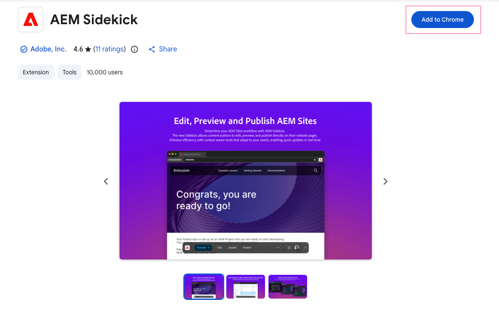
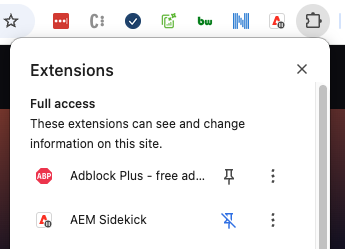
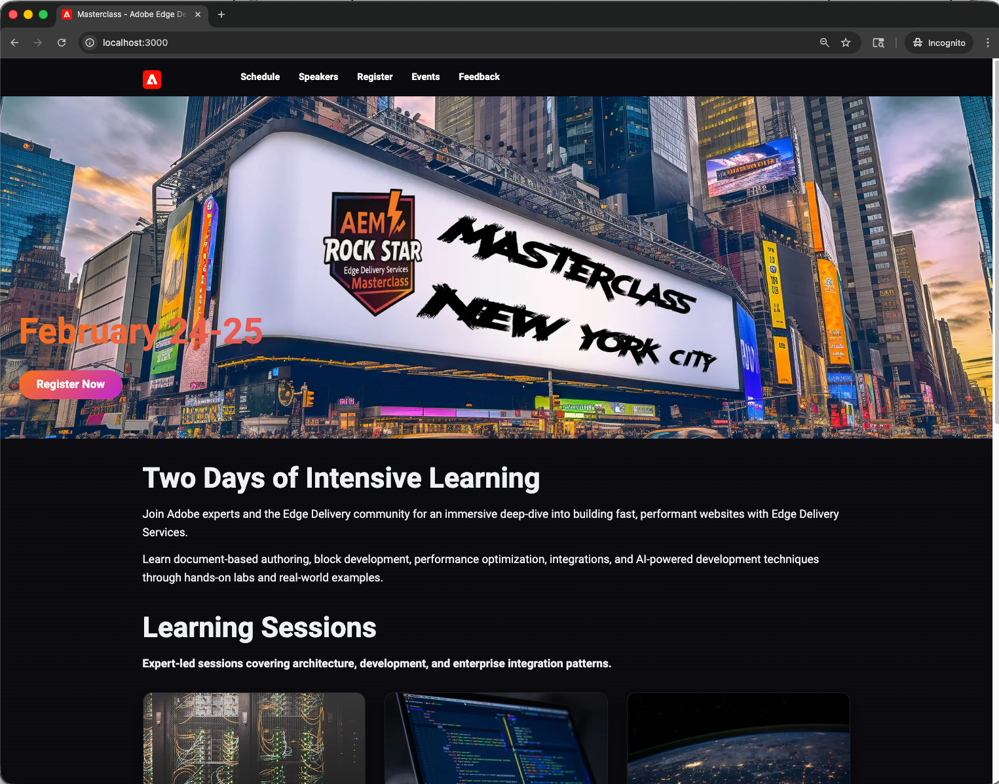
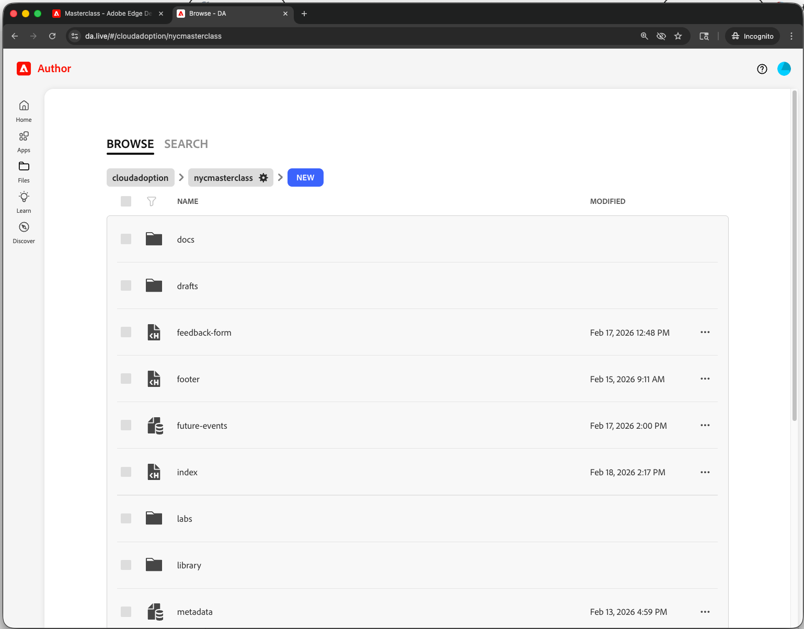
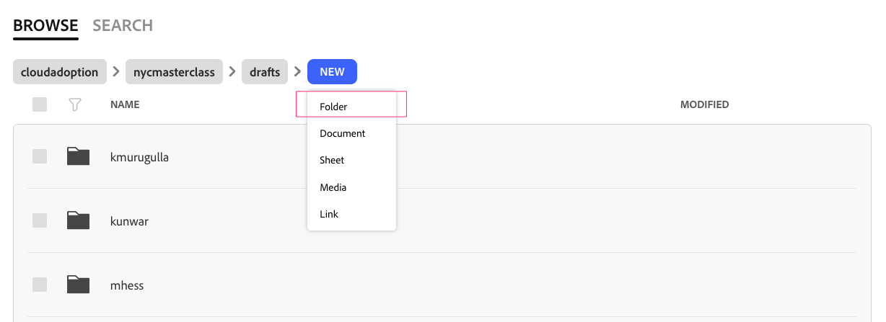
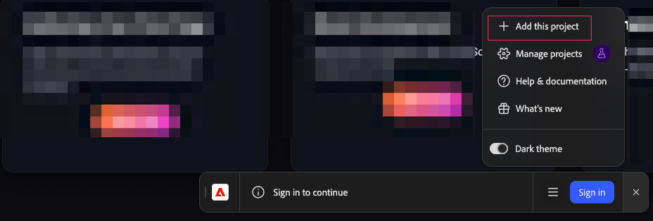
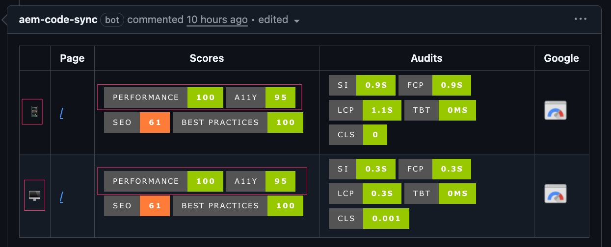

# Lab Setup Instructions

Complete these steps in one go before **Day 1 (AI lab)** and **Day 2 (hands-on exercises)**. Steps 1–7 (including AI coding agent setup) are enough for the AI lab; Steps 8–11 add DA, Sidekick, and EDS for Day 2.

---
**Quick navigation**
- [Lab Setup Instructions](#lab-setup-instructions)
  - [Prerequisites](#prerequisites)
  - [Step 1: Clone Repository](#step-1-clone-repository)
  - [Step 2: Create Feature Branch](#step-2-create-feature-branch)
  - [Step 3: Install AEM CLI](#step-3-install-aem-cli)
  - [Step 4: Install Dependencies](#step-4-install-dependencies)
  - [Step 5: Run Linting](#step-5-run-linting)
  - [Step 6: Start Development Server](#step-6-start-development-server)
  - [Step 7: AI Coding Agent Setup](#step-7-ai-coding-agent-setup)
  - [Step 8: Understand Your Branch URLs](#step-8-understand-your-branch-urls)
  - [Step 9: Verify DA.live Access](#step-9-verify-dalive-access)
  - [Step 10: Add This Project to Sidekick](#step-10-add-this-project-to-sidekick)
  - [Step 11: Verify EDS, DA Permissions](#step-11-verify-eds-da-permissions)
  - [Git Workflow](#git-workflow)
    - [During exercises:](#during-exercises)
    - [Pull latest changes:](#pull-latest-changes)
  - [Creating a Pull Request](#creating-a-pull-request)
    - [PR Requirements](#pr-requirements)
    - [Steps to Create PR](#steps-to-create-pr)
  - [URL Reference](#url-reference)
  - [Troubleshooting](#troubleshooting)
    - [Port 3000 in use](#port-3000-in-use)
    - [Git push rejected](#git-push-rejected)
    - [DA.live "Permission denied"](#dalive-permission-denied)
    - [AEM CLI not found](#aem-cli-not-found)
  - [Validation Checklist](#validation-checklist)
  - [Ready to Start](#ready-to-start)

---

## Prerequisites

Before arriving at the lab, ensure the following are installed:

- Git installed
- Node.js v18 or higher
- Code editor (Cursor / Claude Code / VS Code)
- Web browser (Chrome or Edge — required for AEM Sidekick)
- **GitHub CLI** — so your AI coding agent can manage branches and PRs. Install: `brew install gh` (macOS) or `winget install GitHub.cli` (Windows). Then run `gh auth login`.
- **AEM Sidekick browser extension** installed and pinned — [Install from Chrome Web Store](https://chromewebstore.google.com/detail/aem-sidekick/igkmdomcgoebiipaifhmpfjhbjccggml)





---

## Step 1: Clone Repository

```bash
git clone https://github.com/cloudadoption/nycmasterclass.git
cd nycmasterclass
```

---

## Step 2: Create Feature Branch

Use first initial + last name (e.g., John Smith = `jsmith`)

```bash
git checkout -b jsmith
```

**Important**: Use lowercase, no spaces or special characters.

---

## Step 3: Install AEM CLI

```bash
npm install -g @adobe/aem-cli
```

Verify:
```bash
aem --version
```

Expected output: Version number (e.g., `16.x.x`)

---

## Step 4: Install Dependencies

```bash
npm install
```

This installs ESLint, Stylelint, and other dev dependencies.

---

## Step 5: Run Linting

Before starting development, verify linting works:

```bash
npm run lint
```

Expected output: No errors (warnings are OK for boilerplate)

**What this checks**:
- ESLint (Airbnb JavaScript style)
- Stylelint (CSS standards)

**Important**: Never commit code with linting errors. Run `npm run lint` before every commit.

---

## Step 6: Start Development Server

- **For Day 2 exercises**: `aem up` — content comes from EDS/DA.
- **For the AI lab (Day 1)**: `aem up --html-folder drafts` — serves local `drafts/` so the agent can create and view test pages (e.g. `drafts/tmp/speakers`, `drafts/tmp/schedule`).

The server starts at: http://localhost:3000

**Keep this running** throughout the lab. Open a new terminal for Git commands.

**Verify**: Open http://localhost:3000 — you should see the NYC Masterclass homepage (or the drafts index if using `--html-folder drafts`).



---

## Step 7: AI Coding Agent Setup

To get the most from the AI-assisted development lab, set up an AI coding agent and open this project in it. The repo already includes AGENTS.md and skills; your agent will use them automatically.

**Required: AI coding agent** — at least one of:

| Agent | Notes |
|-------|--------|
| **Claude Code** | `npm install -g @anthropic-ai/claude-code` — requires Claude Pro/Team |
| **Cursor** | [cursor.com](https://cursor.com) — enable Agent mode |
| **OpenAI Codex CLI** | `npm install -g @openai/codex` — requires ChatGPT Plus/Pro/Business |
| **GitHub Copilot** | VS Code + Copilot extension — open Chat, use Agent mode |

If you don't have one, you can still follow the demo by watching the instructor.

If you installed GitHub CLI (Prerequisites), your agent can use it for branch management and PRs.

**Optional: Playwright MCP** — lets the agent open localhost, take screenshots, and verify blocks. Example for Claude Code:
```bash
claude mcp add --transport stdio playwright -- npx @playwright/mcp@latest
```

For other tools, see [Playwright MCP](https://github.com/microsoft/playwright-mcp).

---

## Step 8: Understand Your Branch URLs

EDS serves a separate preview and live URL per GitHub branch. The pattern is:

- Preview: `https://{branch}--nycmasterclass--cloudadoption.aem.page/`
- Live: `https://{branch}--nycmasterclass--cloudadoption.aem.live/`

**Main branch** (always available — use this as your reference throughout the lab):
- Preview: https://main--nycmasterclass--cloudadoption.aem.page/
- Live: https://main--nycmasterclass--cloudadoption.aem.live/

> Your personal branch URLs (e.g. `jsmith--nycmasterclass--cloudadoption.aem.page`) become active after your first `git push` in Exercise 2.

---

## Step 9: Verify DA.live Access

1. Go to https://da.live/#/cloudadoption/nycmasterclass
2. Complete the Sign In process using the Adobe ID provided to obtain access
   > If your Adobe ID is tied to a Personal Account, choose that instead of Corporate Account
3. You should see the project and folder structure

   

4. Navigate into `/drafts`
5. Create a folder: `/drafts/<yourname>` (e.g. `/drafts/jsmith`)

   

6. Confirm you can create and edit pages inside that folder

**If you cannot access**:
- Verify you're logged in with your Adobe IMS account
- Ask instructor to verify permissions

---

## Step 10: Add This Project to Sidekick

With your dev server running, add the NYC Masterclass project to your Sidekick extension so the toolbar appears on your pages.

1. Open [main--nycmasterclass--cloudadoption.aem.page](https://main--nycmasterclass--cloudadoption.aem.page/) in Chrome or Edge
2. Click the **AEM Sidekick** icon in your browser toolbar
   > If this the first time that you are viewing sidekick extension , go through the overview
3. Click **Add project** from sidekick extension



4. Refresh the page — the Sidekick toolbar should appear at the top with **Preview** and **Publish** buttons


**Verify**: Open [localhost:3000/sessions/architecture-deep-dive](http://localhost:3000/sessions/architecture-deep-dive) and confirm the Sidekick toolbar also appears there.

---

## Step 11: Verify EDS, DA Permissions

You should have `publish` role which includes:
- `preview:read`, `preview:write` (access to `.aem.page`)
- `live:write` (publish to `.aem.live`)

**Check your role**: [User Admin](https://tools.aem.live/tools/user-admin/index.html?org=cloudadoption&site=nycmasterclass) — manage users and roles for this org/site.

**Test**: In DA.live, open an existing page (e.g., [sessions/architecture-deep-dive](https://da.live/edit#/cloudadoption/nycmasterclass/sessions/architecture-deep-dive)) and click **Preview**. If it opens at `.aem.page`, permissions are correct.

**If preview fails**: Ask instructor to verify EDS Admin API permissions.

---

## Git Workflow

### During exercises:

After completing each exercise:

```bash
# Run linting first (must pass with no errors)
npm run lint

# Add your changes
git add blocks/block-name/

# Commit with conventional commit message
git commit -m "feat: add block-name block"

# Push to your branch (replace jsmith with your branch name)
git push origin <your-branch>
```

### Pull latest changes:

```bash
git pull origin main
```

Do this before starting new exercises if instructor made updates.

---

## Creating a Pull Request

At the end of the lab, you'll create a PR to merge your work to main.

### PR Requirements

1. **No linting errors**: Run `npm run lint` - must be clean
2. **Test URLs**: Include before/after links showing your changes
   >before : points to main branch and all impacted pages
   >after: point to feature branch and all impacted pages
3. **Lighthouse scores**: 100 on both mobile and desktop on PR(Highly Recommended)

### Steps to Create PR

**1. Verify linting**:
```bash
npm run lint
```

Fix any errors before proceeding.

**2. Test a page with your changes**:

Pick a page that demonstrates your work (e.g., `/drafts/<your-name>/sessions` from Exercise 4).

**3. Run PageSpeed Insights**:

```
https://developers.google.com/speed/pagespeed/insights/?url=https://<your-branch>--nycmasterclass--cloudadoption.aem.page/drafts/<your-name>/sessions
```

**Target**: 100 on both mobile and desktop.

**If scores are low** — troubleshoot in this order before asking for help:

1. **Check what you added, not the boilerplate** — the starter project already scores 100. Low scores are almost always caused by code you introduced.
2. **Images** — avoid committing large images to Git. Use DA.live to upload images (they get optimized automatically) or use external URLs. If you must commit an image, compress it first (< 100 KB).
3. **JavaScript** — keep block JS minimal. Avoid importing large libraries. Use native browser APIs (fetch, DOM) instead of frameworks.
4. **CSS** — put only above-the-fold styles in your block CSS. Avoid `@import` statements in your blocks that are used above-the-fold.
5. **Render-blocking resources** — never add additional `<link>` or `<script>` tags to `head.html` unless absolutely necessary. Use `lazy-styles.css` or `delayed.js` for non-critical resources.
6. **Run PSI again** — scores can vary ±5 points between runs due to network conditions. Run 2-3 times before worrying.
7. **Reference**: [Keeping It 100 — EDS Performance Guide](https://www.aem.live/developer/keeping-it-100)

> **Note on SEO scores**: Preview/development URLs (`.aem.page`) return `x-robots-tag: noindex, nofollow` headers, so PageSpeed Insights will flag SEO issues like "Page is blocked from indexing." **This is expected and not a problem.** These URLs are intentionally excluded from search engines. SEO scores will be full marks on production (`.aem.live`) URLs with proper domain mapping and real content.

**4. Create PR on GitHub**:

Go to: https://github.com/cloudadoption/nycmasterclass/pulls

Click "New Pull Request"

**Base**: `main` ← **Compare**: `jsmith` (your branch)

**PR Description Template**:
```
## Summary
Added blocks from lab exercises: page-list, dynamic-cards, etc.

## Test URLs

**Before** (main branch):
https://main--nycmasterclass--cloudadoption.aem.live/drafts/<your-name>/sessions

**After** (my branch):
https://jsmith--nycmasterclass--cloudadoption.aem.live/drafts/<your-name>/sessions

## Lighthouse Scores

- Mobile: 100
- Desktop: 100

Screenshot: [attach screenshot of PSI results]

## Changes
- Added page-list block (Exercise 4)
- Added dynamic-cards block (Exercise 3)
- Added registration-form block (Exercise 6)
```

Replace `jsmith` and URLs with your actual values.



**5. Request Review**:

Assign the instructor as a reviewer.

**Important**: Only the PR author (you) should merge after approval. Never merge someone else's PR without asking.

**Reference**: [Development & Collaboration Best Practices](https://www.aem.live/docs/dev-collab-and-good-practices)

---

## URL Reference

| Environment | URL pattern | When it updates |
|---|---|---|
| Local | `http://localhost:3000/<path>` | Immediately on file save |
| Preview | `https://{branch}--nycmasterclass--cloudadoption.aem.page/<path>` | After DA.live Preview or `git push` |
| Live | `https://{branch}--nycmasterclass--cloudadoption.aem.live/<path>` | After DA.live Publish |

Use `main` as the branch for the reference site. Use your branch name (e.g. `jsmith`) for your own work — available after your first `git push` in Exercise 2.

---

## Troubleshooting

### Port 3000 in use

```bash
pkill -f aem-cli
aem up
```

### Git push rejected

Branch may be protected. Verify you're on your feature branch:
```bash
git branch
```

Should show `* jsmith` (your branch name).

### DA.live "Permission denied"

Log out and log back in to refresh IMS tokens.

### AEM CLI not found

Re-run global install:
```bash
npm install -g @adobe/aem-cli
```

On Mac/Linux, may need `sudo`:
```bash
sudo npm install -g @adobe/aem-cli
```

---

## Validation Checklist

**For AI lab (Day 1)** — before [AI-Assisted Development](ai-dev/instructions.md):

- [ ] Repository cloned
- [ ] Feature branch created (e.g., `jsmith`)
- [ ] AEM CLI installed (`aem --version` works)
- [ ] Dependencies installed (`npm install` completed)
- [ ] Linting runs clean (`npm run lint` no errors)
- [ ] Dev server running with drafts: `aem up --html-folder drafts` — `http://localhost:3000` loads
- [ ] AI coding agent set up (Cursor, Claude Code, Codex, or Copilot) and project opened in it

**For Day 2 exercises** — add these before [Exercise 1](exercise1/instructions.md):

- [ ] DA.live access verified (can view project, create folder in `/drafts/<yourname>`)
- [ ] AEM Sidekick extension installed (Chrome/Edge)
- [ ] Sidekick project added — toolbar visible on `localhost:3000`
- [ ] Branch URL pattern understood — `main--` URLs verified as working
- [ ] EDS/DA permissions verified (preview works from DA)
- [ ] Git workflow clear (lint, add, commit, push)
- [ ] PR process understood (test URLs, Lighthouse scores)

---

## Ready to Start

- **Day 1**: Once the AI lab checklist is complete, proceed to [AI-Assisted Development](ai-dev/instructions.md).
- **Day 2**: Once the full checklist is complete, proceed to [Exercise 1](exercise1/instructions.md).

**Solutions**: Complete solutions for all lab exercises are on the [answers branch](https://github.com/cloudadoption/nycmasterclass/tree/answers). Each exercise also links to this branch in its Solution section.
