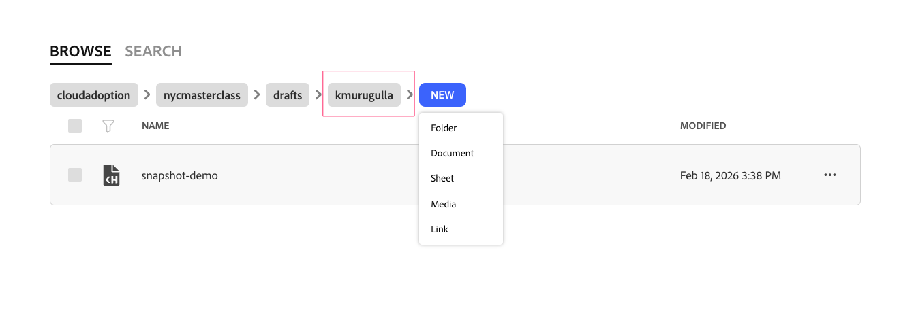
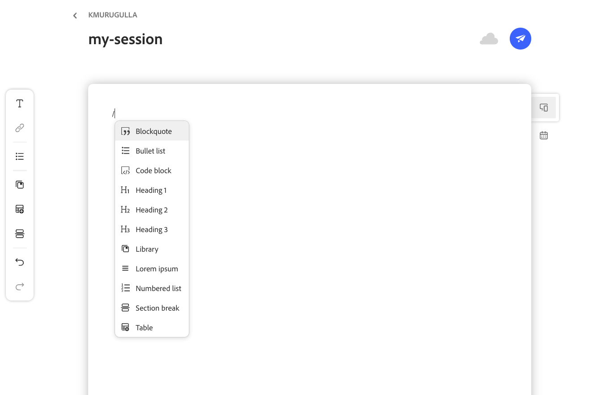
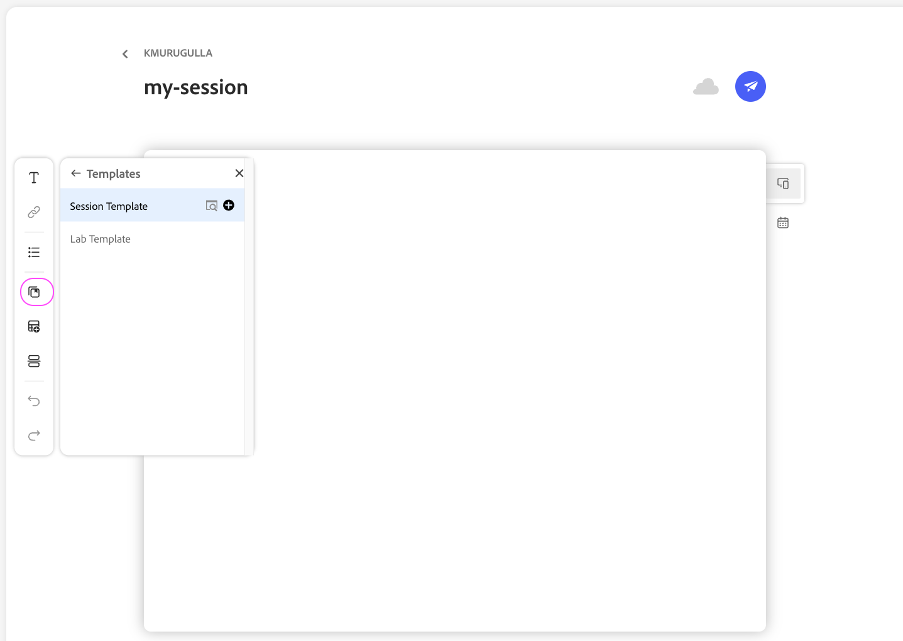
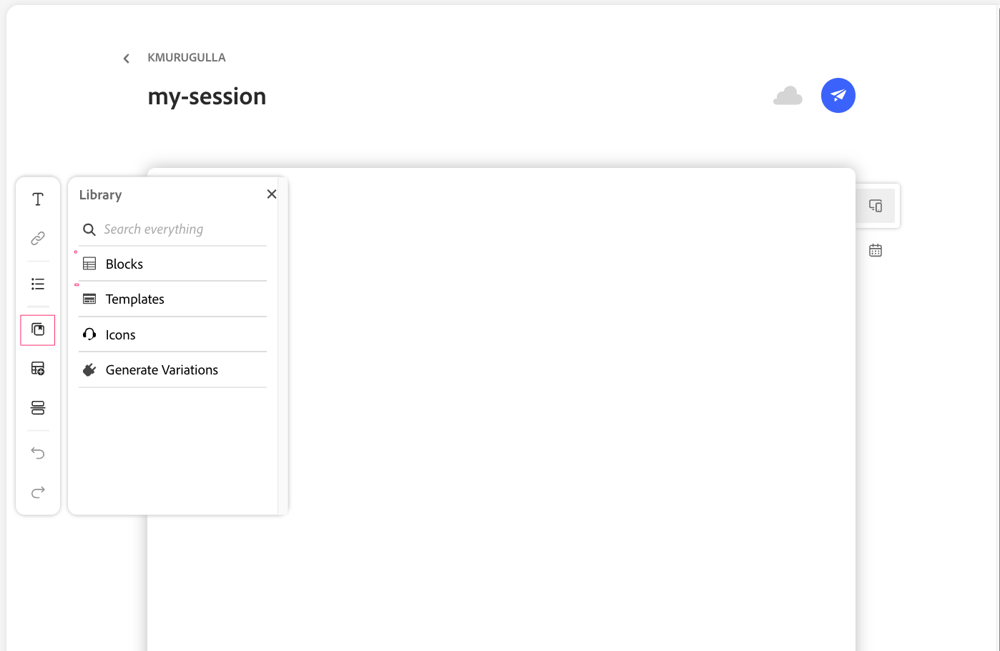
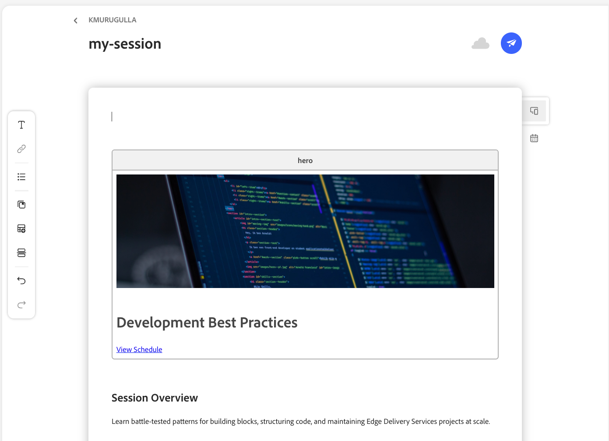
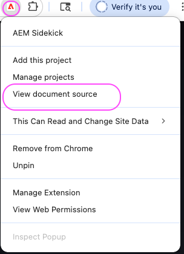

# Exercise 1: Authoring Your First Page

**Duration**: 20 minutes

---
**Quick navigation**
- **Context**
  - [What You'll Learn](#what-youll-learn)
  - [DA.live: The Authoring Tool](#dalive-the-authoring-tool)
  - [Before You Start](#before-you-start)
- **Hands-on**
  - [Step 1: Create Your Page](#step-1-create-your-page)
  - [Step 2: Start From a Template](#step-2-start-from-a-template)
  - [Step 3: Update Your Content](#step-3-update-your-content)
  - [Step 4: Update Metadata](#step-4-update-metadata)
  - [Step 5: Preview](#step-5-preview)
  - [Step 6: Inspect the Content Transformation](#step-6-inspect-the-content-transformation)
  - [Step 7: Publish](#step-7-publish)
- [Verification Checklist](#verification-checklist)
- [References](#references)
- [Next Exercise](#next-exercise)

---

**Quick navigation**
- **Context**
  - [What You'll Learn](#what-youll-learn)
  - [DA.live: The Authoring Tool](#dalive-the-authoring-tool)
- **Hands-on Lab**
  - [Create Your Page](#step-1-create-your-page)
  - [Update Metadata](#step-4-update-metadata)
  - [Save and Preview](#step-5-save-and-preview)
  - [Publish](#step-7-publish)
- [Verification Checklist](#verification-checklist)

---

## Prerequisites

**Complete [SETUP.md](../SETUP.md) before starting this exercise.** Exercises can be done in sequence or independently; if independent, ensure SETUP is done and you have the items below.

**Required:**
- Dev server running at `http://localhost:3000`
- DA.live access verified: [da.live/#/cloudadoption/nycmasterclass](https://da.live/#/cloudadoption/nycmasterclass)
- Personal folder exists at `/drafts/<your-name>/` (first initial + last name, all lowercase — e.g. John Smith → `jsmith`)
- AEM Sidekick installed and this project added — toolbar is visible when you open `localhost:3000`

> **Your personal `jsmith--nycmasterclass--cloudadoption.aem.page` URL does not exist yet.**
> It becomes active only after your first `git push` in Exercise 2.
> In this exercise, use `localhost:3000` and the `main--` URLs shown below.

---

## What You'll Learn

- How to author content in **DA.live** — the browser-based editor purpose-built for EDS
- How a table in DA.live becomes a decorated block on the rendered page
- How **Preview** and **Publish** update `.aem.page` and `.aem.live` respectively
- How to inspect your content at each transformation stage: document source, `.plain.html`, `.md`

---

## DA.live: The Authoring Tool

This lab uses **DA.live** — a purpose-built, browser-based document editor for EDS. It is not Google Docs, Microsoft Word, or SharePoint. DA.live gives authors a familiar word-processor experience in the browser, but the underlying format is clean semantic HTML.

**The key pattern — tables become blocks:**

A table authored in DA.live:

```
| Hero                   |
|------------------------|
| Welcome to Masterclass |
```

Becomes this HTML after EDS processes it:

```html
<div class="hero">
  <div><div>Welcome to Masterclass</div></div>
</div>
```

The table header (`Hero`) becomes the CSS class. Developers write `blocks/hero/hero.js` and `blocks/hero/hero.css` to decorate it. Authors never write CSS class names — the table structure *is* the contract between author and developer.

**The content pipeline:**

```
DA.live editor
     │
     │  Save
     ▼
Preview (.aem.page) ── code from main GitHub branch
     │                  content from DA.live
     │  Publish
     ▼
Live (.aem.live) ──── same code, same content (promoted to production)
```

For a full overview of EDS authoring: [aem.live/docs/authoring](https://www.aem.live/docs/authoring)

---

## Before You Start

Spend 2 minutes reviewing an existing page before creating your own. Open these side-by-side:

- **In DA.live** (author's view): [sessions/architecture-deep-dive](https://da.live/edit#/cloudadoption/nycmasterclass/sessions/architecture-deep-dive)
- **Rendered** (visitor's view): [localhost:3000/sessions/architecture-deep-dive](http://localhost:3000/sessions/architecture-deep-dive)

Notice how the tables you see in DA.live become the styled components on the rendered page. That transformation is what this exercise is about.

---

## Step 1: Create Your Page

1. Go to [da.live/#/cloudadoption/nycmasterclass](https://da.live/#/cloudadoption/nycmasterclass)
2. Navigate into `/drafts/<your-name>/`
3. Click **New** → **Page**
4. Name it `my-session` or `my-lab`



---

## Step 2: Start From a Template

DA.live provides **session** and **lab** templates for this project. Using a template inserts all the required blocks and sections pre-populated with placeholder content — you fill in the details rather than building from scratch.

In the page editor:

1. Type `/` to open the slash command menu

   

2. Select **Templates**
3. Choose **Session** or **Lab** depending on what you are creating

   

The template inserts a Hero block, content sections, and a Metadata block — all with placeholder text.

> **Didn't find a template?** You can also insert individual blocks via the **Blocks Library**:
> Type `/` → select **Blocks** → browse and insert any block with placeholder content pre-filled.
>
> 
>
> Or insert a table manually with `/table` and type the block name in row 1.

---

## Step 3: Update Your Content

With the template inserted, replace each placeholder with your own content.

**Hero block** — update the title and keep the schedule link:

```
| Hero                                                                           |
|--------------------------------------------------------------------------------|
| [Your Session or Lab Title]                                                    |
| [View Schedule](https://main--nycmasterclass--cloudadoption.aem.page/schedule) |
```



**Content sections** — fill in the overview and objectives below the Hero block:

```
## Session Overview

[2–3 sentences describing this session or lab]

## What You'll Learn

- [Learning objective 1]
- [Learning objective 2]
- [Learning objective 3]
```

> **Tip**: Type `/` anywhere in the document to explore other available insert options — headings, images, links, dividers, and more.

---

## Step 4: Update Metadata

The template includes a Metadata block at the bottom of the page. Fill in the placeholder values. **It must remain the last element on the page.**

**For a session:**

```
| Metadata      |                                    |
|---------------|------------------------------------|
| Title         | [Session Title] - NYC Masterclass  |
| Description   | [Short description for SEO]        |
| speaker-name  | [Speaker Name]                     |
| category      | technical                          |
| session-level | beginner / intermediate / advanced |
```

**For a lab:**

```
| Metadata        |                                         |
|-----------------|-----------------------------------------|
| Title           | Lab: [Lab Title] - NYC Masterclass      |
| Description     | [Short description for SEO]             |
| instructor-name | [Instructor Name]                       |
| category        | development / authoring / configuration |
| difficulty      | beginner / intermediate / advanced      |
```


---

## Step 5: Preview

1. Click **Preview** (in DA.live)

Your page is now available at:

**Local** — uses your local code files + DA.live content:
```
http://localhost:3000/drafts/jsmith/my-session
```

**Main preview** — uses main branch code + DA.live content, accessible without a running dev server:
```
https://main--nycmasterclass--cloudadoption.aem.page/drafts/jsmith/my-session
```

> **Note**: There is no `jsmith--` preview URL yet. That becomes available after `git push origin jsmith` in Exercise 2. Until then, `localhost:3000` is your working environment.

Open your page on `localhost:3000`. Compare it against the reference live site:
[main--nycmasterclass--cloudadoption.aem.live](https://main--nycmasterclass--cloudadoption.aem.live/)

---

## Step 6: Inspect the Content Transformation

This is the core learning step. Your page exists in multiple representations simultaneously. Open each one and observe how the content changes form as it moves through the EDS pipeline.

### Document Source — what the author wrote

With your page open at `http://localhost:3000/drafts/jsmith/my-session`, click the **AEM Sidekick** icon in your toolbar and select **View document source**.



**What you see**: Raw HTML from DA.live — tables are still `<table>` elements, no `class="hero"`, no block structure. This is exactly what the author wrote.

---

### `.plain.html` — what EDS processes

Open in a new tab. Available on both local and the main preview environment:

```
http://localhost:3000/drafts/jsmith/my-session.plain.html
https://main--nycmasterclass--cloudadoption.aem.page/drafts/jsmith/my-session.plain.html
```

**What you see**: EDS has transformed your Hero table into block divs:

```html
<div class="hero">
  <div><div>Your Session Title</div></div>
  <div><div><a href="...">View Schedule</a></div></div>
</div>
```

The Metadata table is gone — EDS has processed it into `<head>` tags. This `.plain.html` is what JavaScript receives when `decorate(block)` is called.

---

### `.md` — the content as Markdown

Open in a new tab:

```
http://localhost:3000/drafts/jsmith/my-session.md
https://main--nycmasterclass--cloudadoption.aem.page/drafts/jsmith/my-session.md
```

**What you see**: Your content as Markdown — tables, headings, and lists in plain text format. This is the storage format EDS uses internally.

---

### The transformation at a glance

| What you open | What it shows |
|---|---|
| `localhost:3000/…` | Fully rendered page — `.plain.html` decorated by JavaScript and CSS |
| `…/my-session.plain.html` | EDS-processed HTML — tables become `<div class="blockname">`, Metadata → `<head>` |
| Document Source (Sidekick) | Raw DA.live HTML — what the author wrote, unprocessed |
| `…/my-session.md` | Markdown — the storage format |

---

## Step 7: Publish

1. In DA.live, click **Publish** (or use the Sidekick toolbar on the page)
2. Wait for the confirmation banner

Your page is now on the **live** environment. Verify all three representations are accessible:

```
https://main--nycmasterclass--cloudadoption.aem.live/drafts/jsmith/my-session
https://main--nycmasterclass--cloudadoption.aem.live/drafts/jsmith/my-session.plain.html
https://main--nycmasterclass--cloudadoption.aem.live/drafts/jsmith/my-session.md
```

**What happened**: The EDS Admin API promoted your content from `.aem.page` (preview) to `.aem.live` (production). The `.plain.html` and `.md` are identical across both environments — the only difference is *when* content appears: after Preview vs. after Publish.

> **When does your `jsmith--` live URL appear?**
> `https://jsmith--nycmasterclass--cloudadoption.aem.live/...` becomes active after you push your feature branch in Exercise 2. Content on `.aem.live` is the same regardless of branch — only the *code* (blocks, scripts, styles) differs between `main--` and `jsmith--`.

---

## Verification Checklist

- [ ] Page created in DA.live under `/drafts/<your-name>/`
- [ ] Hero block renders at the top with title and schedule link
- [ ] Content (overview, objectives) appears below the Hero
- [ ] Metadata is the last element on the page
- [ ] Page visible at `http://localhost:3000/drafts/<your-name>/my-session`
- [ ] **Document source** viewed via Sidekick — tables visible, no `class="hero"`
- [ ] **`.plain.html`** opened on `localhost:3000` — Hero table is now `<div class="hero">`
- [ ] **`.plain.html`** opened on `main--nycmasterclass--cloudadoption.aem.page` — matches local
- [ ] **`.md`** opened and content confirmed
- [ ] Page published via DA.live
- [ ] All three representations accessible on `main--nycmasterclass--cloudadoption.aem.live`

---

## Solution

Reference content and solutions for all lab exercises are on the [answers branch](https://github.com/cloudadoption/nycmasterclass/tree/answers).

---

## References

- [AEM Authoring](https://www.aem.live/docs/authoring)
- [AEM Sidekick](https://www.aem.live/docs/sidekick)
- [Markup, Sections, Blocks](https://www.aem.live/developer/markup-sections-blocks)

---

## Next Exercise

**Exercise 2**: Block Development — You'll read the existing `blocks/cards/cards.js` to understand how EDS transforms the `.plain.html` you just inspected into styled, interactive components. Then you'll create test content in DA.live and push your first commit — which is also when your personal `jsmith--` preview URL comes to life.
