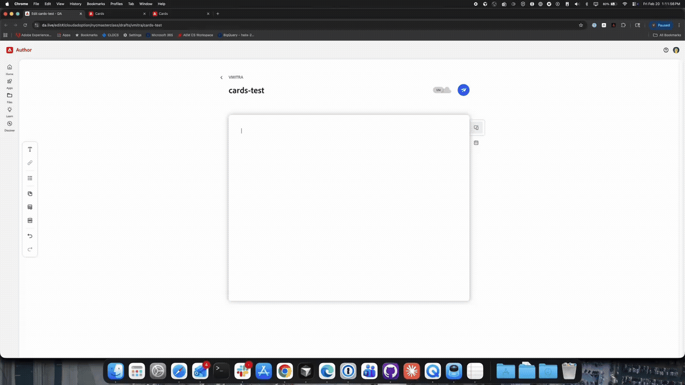
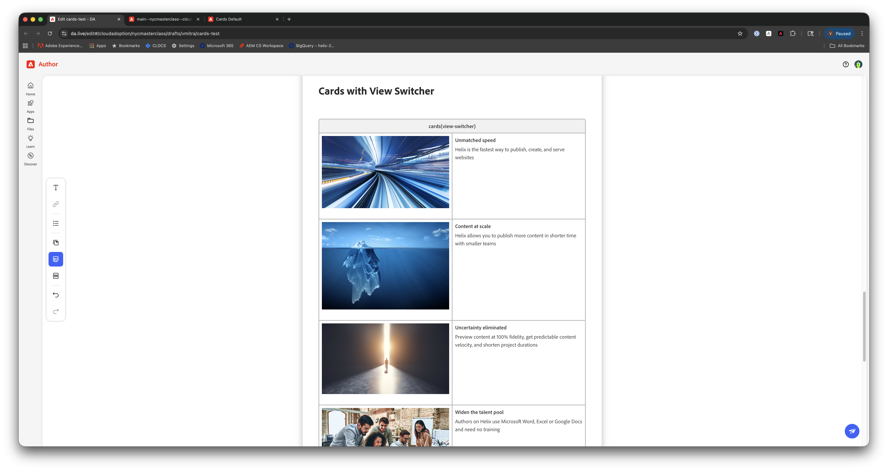

# Exercise 2: Block Development - Enhancements & Variations

**Duration**: 20 minutes

---

**Quick navigation**
- **Context**
  - [What You'll Learn](#what-youll-learn)
  - [Why This Matters](#why-this-matters)
  - [How Block Decoration Works](#how-block-decoration-works)
- **Hands-on Lab**
  - [Step 1: Create Test Content](#step-1-create-test-content)
  - [Step 2: Test Default Cards](#step-2-test-default-cards)
  - [Step 3: Implement Eyebrow Enhancement](#step-3-implement-eyebrow-enhancement)
  - [Step 4: Test Eyebrow Enhancement](#step-4-test-eyebrow-enhancement)
  - [Step 5: Implement List Variation](#step-5-implement-list-variation)
  - [Step 6: Test List Variation](#step-6-test-list-variation)
  - [Step 7: Implement View Switcher Variation](#step-7-implement-view-switcher-variation)
  - [Step 8: Test View Switcher Variation](#step-8-test-view-switcher-variation)
  - [Step 9: Commit Your Changes](#step-9-commit-your-changes)
- [Key Takeaways](#key-takeaways)

---

## Prerequisites

**Complete [SETUP.md](../SETUP.md) if not already done.** Exercises can be done in sequence or independently; if independent, ensure SETUP is done and you have the items below.

**Required:**
- On your feature branch (`jsmith` — first initial + last name, lowercase)
- Local dev server at `http://localhost:3000`
- Code editor open with the repository
- Exercise 1 completed (if doing in sequence)

**Verify you're on your branch**:
```bash
git branch
# Should show: * jsmith (your name)
```

---

## What You'll Learn

- How the block decoration lifecycle works
- How to enhance a block by detecting content patterns (eyebrow from `<em>`)
- How to implement a block variation (list layout)
- How to write mobile-first responsive CSS
- The difference between a block **enhancement** and a block **variation**

---

## Why This Matters

In Exercise 1, you created content as an author. Now you'll see the developer side - writing the code that transforms authored content into styled, interactive components.

**The Block Contract**: Authors create tables with a specific structure. Developers write JavaScript to decorate (transform) that HTML into the final presentation.

There are two ways to extend a block's capabilities:

**Block Enhancements** make the block smarter by detecting content patterns:
- Authors use familiar formatting (bold, italic, links) in their content
- The block recognizes these patterns and renders them specially
- No extra configuration needed — it just works

**Block Variations** can be used to change the block's layout via a class:
- Authors add variation names in parentheses: `Cards (List)`
- CSS/JS targets the variation class for a different presentation
- Same block codebase → multiple layouts

**Real-world scenario**: A Cards block can detect italic text and render it as an eyebrow label (enhancement), or switch to a single-column list layout (variation).

---

## How Block Decoration Works

```
1. Author creates table in DA.live
   | Cards |                            |
   |-------|----------------------------|
   | [image] | *Speaker* (italic)       |
   |         | John Doe                 |
   |         | Senior Developer         |

2. EDS converts to HTML (before decoration)
   <div class="cards">
     <div>
       <div><picture>...</picture></div>
       <div>
         <p><em>Speaker</em></p>
         <p>John Doe</p>
         <p>Senior Developer</p>
       </div>
     </div>
   </div>

3. Your decorate() function transforms it
   - Classifies divs as image or body
   - Detects <em> in body → extracts as eyebrow label
   - Removes the <em> paragraph from body
   - Prepends eyebrow div to card body

4. Final HTML (after decoration)
   <div class="cards">
     <ul>
       <li>
         <div class="cards-card-image"><picture>...</picture></div>
         <div class="cards-card-body">
           <div class="cards-card-eyebrow">Speaker</div>
           <p>John Doe</p>
           <p>Senior Developer</p>
         </div>
       </li>
     </ul>
   </div>

5. CSS styles the decorated HTML
```

**Reference**: [Exploring Blocks](https://www.aem.live/docs/exploring-blocks)

---

## Block Anatomy

Every block has:

```
blocks/
  cards/
    cards.js      - Decoration logic (required)
    cards.css     - Styles (required)
```

**Entrypoint**: The runtime calls the default export of each block's `.js` file. That export must be a `decorate(block)` function — same for every block. EDS passes the block's root DOM element; your code transforms it.

**Naming convention**: File names must match block name exactly.

**Variation classes**: Authors add variations in parentheses:
```
| Cards (List) |
```

Becomes:
```html
<div class="cards list">
```

Your CSS/JS can then target `.cards.list` for variation-specific styling.

**Reference**: [Anatomy of a Project](https://www.aem.live/developer/anatomy-of-a-project)

---

## Current Cards Block

The repository already has a Cards block. Let's review it:

**File**: `blocks/cards/cards.js`

```javascript
import { createOptimizedPicture } from '../../scripts/aem.js';

export default function decorate(block) {
  const ul = document.createElement('ul');
  [...block.children].forEach((row) => {
    const li = document.createElement('li');
    while (row.firstElementChild) li.append(row.firstElementChild);
    [...li.children].forEach((div) => {
      if (div.children.length === 1 && div.querySelector('picture')) {
        div.className = 'cards-card-image';
      } else {
        div.className = 'cards-card-body';
      }
    });
    ul.append(li);
  });
  ul.querySelectorAll('picture > img').forEach((img) => {
    img.closest('picture').replaceWith(
      createOptimizedPicture(img.src, img.alt, false, [{ width: '750' }])
    );
  });
  block.replaceChildren(ul);
}
```

**What it does**:
- Creates `<ul>` list
- Each row becomes `<li>` (each card)
- Classifies content as image or body
- Replaces each image with a responsive, size-optimized `<picture>` via [createOptimizedPicture()](../../scripts/aem.js) in `aem.js`
- Replaces original block content

**File**: `blocks/cards/cards.css` - Uses CSS Grid for responsive layout.

---

## Step 1: Create Test Content

**In DA.live**, create page: `/drafts/jsmith/cards-test` (replace `jsmith` with your name)

Add content to test the **existing** Cards block (default behavior). Use the **Block Library** so you get the correct block markup:

1. Type `/` → **Library** (or **Blocks**) → find **Cards** and preview variations.
2. Insert **default Cards** (add a heading like "Default Cards" if you like).
3. Insert the **Cards block that includes the eyebrow** (italic label). Add a heading like **Cards with Eyebrow** above it — you'll use this when we add the eyebrow enhancement in Step 3.

  

You'll add List and View Switcher content later when we implement those variations (Steps 5 and 7). DA.live auto-saves. Click **Preview** to see the page on localhost, then continue to Step 2.

---

## Step 2: Test Default Cards

**Open**: `http://localhost:3000/drafts/jsmith/cards-test` (replace `jsmith` with your name)

**Test on desktop and mobile**: Use Chrome DevTools responsive view — open DevTools (F12 or Cmd+Option+I), toggle the device toolbar (Cmd+Shift+M / Ctrl+Shift+M) to switch to responsive mode, then resize the viewport or pick a device preset to verify layout at different widths. Use this for all test steps in this exercise.

**You should see**:
- Default Cards section showing cards in a grid
- A second section with cards that have italic (eyebrow) text — still rendered as plain text for now

  

**Why?** The eyebrow enhancement isn't implemented yet. We'll add it in the next step.

---

## Step 3: Implement Eyebrow Enhancement

The eyebrow adds a label above card content. Authors simply **italicize** the label text in the card body, and the block automatically detects and extracts it as the eyebrow. No variation class needed — this is a smart default behavior.

**Author structure** (each row = one card, 2 columns):
- Column 1: Image
- Column 2: Body text — italicize the eyebrow label (e.g., *Speaker*)

**How it works**: In DA.live, italic text becomes `<em>` in HTML. The block finds `<em>` in each card's body, extracts it, and renders it as an eyebrow label. If there's no `<em>`, nothing changes — the card renders normally.

### Update JavaScript

**File**: `blocks/cards/cards.js`

Replace the entire `decorate` function with:

```javascript
import { createOptimizedPicture } from '../../scripts/aem.js';

export default function decorate(block) {
  const ul = document.createElement('ul');

  [...block.children].forEach((row) => {
    const li = document.createElement('li');
    while (row.firstElementChild) li.append(row.firstElementChild);
    [...li.children].forEach((div) => {
      if (div.children.length === 1 && div.querySelector('picture')) {
        div.className = 'cards-card-image';
      } else {
        div.className = 'cards-card-body';
      }
    });

    // Detect italic text in body and extract as eyebrow label
    const body = li.querySelector('.cards-card-body');
    const em = body?.querySelector('em');
    if (em) {
      const eyebrow = document.createElement('div');
      eyebrow.className = 'cards-card-eyebrow';
      eyebrow.textContent = em.textContent;
      const p = em.closest('p');
      if (p) p.remove();
      else em.remove();
      body.prepend(eyebrow);
    }

    ul.append(li);
  });

  ul.querySelectorAll('picture > img').forEach((img) => {
    img.closest('picture').replaceWith(
      createOptimizedPicture(img.src, img.alt, false, [{ width: '750' }])
    );
  });
  block.replaceChildren(ul);
}
```

**What changed**:
- After classifying divs, looks for `<em>` in each card's body
- If found, extracts the italic text as the eyebrow label
- Removes the `<p>` containing the `<em>` from the body
- Prepends an eyebrow div at the top of the card body
- No variation class needed — works automatically on any Cards block
- Cards without italic text are unaffected

### Add Eyebrow Styles

**File**: `blocks/cards/cards.css`

Add at the end of the file:

```css
.cards .cards-card-eyebrow {
  font-size: 11px;
  font-weight: 700;
  text-transform: uppercase;
  letter-spacing: 0.5px;
  margin-bottom: 8px;
  color: var(--brand-1);
}
```

**Key points**:
- `.cards .cards-card-eyebrow` — scoped to the block, no variation class needed
- All selectors start with `.cards` (proper scoping)

---

## Step 4: Test Eyebrow Enhancement

**Refresh**: `http://localhost:3000/drafts/jsmith/cards-test` (replace `jsmith` with your name)

**You should see**:
- The section with the eyebrow heading now shows "SPEAKER" (or your label) at the top of each card's body
- Label is uppercase, smaller font, brand color
- The italic text you authored is no longer displayed inline — it's been extracted into the eyebrow
- Default Cards section is unaffected (no italic text = no eyebrow)

  
---

## Step 5: Implement List Variation

The list variation displays cards in a single column with centered text. Authors opt in by writing `Cards (List)` as the block name.

**Add content to test it**: In DA.live, open your cards-test page. Type `/` → Library → Blocks → insert **Cards (List)** (add a heading like "List Variation" if you like). Preview so the page has a section to verify in Step 6.

  

### Add List Styles

**File**: `blocks/cards/cards.css`

Add at the end of the file:

```css
/* List layout — used by Cards (List) variant and View Switcher toggle */
.cards.list > ul {
  grid-template-columns: 1fr;
}

.cards.list .cards-card-body {
  text-align: center;
}
```

**What this does**:
- Forces single column layout (overrides default grid)
- Centers body text
- Images stay full-width (inherited from base styles)

**No JavaScript needed** - this variation is CSS-only!

---

## Step 6: Test List Variation

**Refresh**: `http://localhost:3000/drafts/jsmith/cards-test` (replace `jsmith` with your name)

**You should see**:
- List section displays as a single column
- Cards are full width with full-width images
- Text is centered


---

## Step 7: Implement View Switcher Variation

Now let's add a variation that combines **JavaScript and CSS**. The view switcher adds toggle buttons that let users switch between grid and list views on the fly.

**Add content to test it**: In DA.live, open your cards-test page. Type `/` → Library → Blocks → insert **Cards (View Switcher)** (add a heading like "View Switcher" if you like). Preview so the page has a section to verify in Step 8.

  

**This is different from list**: List is a fixed layout chosen by the author. View switcher gives the **end user** control over the layout.

### Update JavaScript

**File**: `blocks/cards/cards.js`

Add this code at the end of the `decorate` function, **after** `block.replaceChildren(ul)`:

```javascript
  if (block.classList.contains('view-switcher')) {
    const toolbar = document.createElement('div');
    toolbar.className = 'cards-toolbar';

    const isList = block.classList.contains('list');

    const gridBtn = document.createElement('button');
    gridBtn.textContent = 'Grid';
    gridBtn.className = `cards-toolbar-btn${isList ? '' : ' active'}`;

    const listBtn = document.createElement('button');
    listBtn.textContent = 'List';
    listBtn.className = `cards-toolbar-btn${isList ? ' active' : ''}`;

    gridBtn.addEventListener('click', () => {
      block.classList.remove('list');
      gridBtn.classList.add('active');
      listBtn.classList.remove('active');
    });

    listBtn.addEventListener('click', () => {
      block.classList.add('list');
      listBtn.classList.add('active');
      gridBtn.classList.remove('active');
    });

    toolbar.append(gridBtn, listBtn);
    block.prepend(toolbar);
  }
```

**What this does**:
- Checks for the `view-switcher` variation class
- Detects whether `list` is already on the block (e.g. `Cards (List, View Switcher)`) and highlights the correct default button
- Grid button removes the `list` class → grid layout
- List button adds the `list` class → single column layout (same CSS as `Cards (List)`)
- Active button is highlighted

### Add View Switcher Styles

**File**: `blocks/cards/cards.css`

Add the toolbar styles at the end of the file:

```css
/* View switcher toolbar — hidden on narrow viewports, shown from 600px up */
.cards.view-switcher .cards-toolbar {
  display: none;
  justify-content: flex-end;
  gap: 8px;
  margin-bottom: 1rem;
}

@media (width >= 600px) {
  .cards.view-switcher .cards-toolbar {
    display: flex;
  }
}

.cards.view-switcher .cards-toolbar-btn {
  background: transparent;
  border: 1px solid rgb(255 255 255 / 20%);
  color: var(--muted);
  padding: 8px 16px;
  border-radius: 8px;
  cursor: pointer;
  font-size: 14px;
  transition: background 0.2s ease, color 0.2s ease;
}

.cards.view-switcher .cards-toolbar-btn:hover {
  border-color: rgb(255 255 255 / 40%);
}

.cards.view-switcher .cards-toolbar-btn.active {
  background: var(--brand-1);
  color: white;
  border-color: var(--brand-1);
}
```

**Key insight**: The view switcher toggles the `list` class — the same class used by `Cards (List)`. No duplicate layout CSS needed. When the user clicks "List", the `.cards.list` styles from Step 5 kick in automatically.

---

## Step 8: Test View Switcher Variation

**Refresh**: `http://localhost:3000/drafts/jsmith/cards-test` (replace `jsmith` with your name)

**Note**: The Grid/List toolbar is hidden on narrow viewports and appears at 600px width and up. Use Chrome DevTools responsive view at ≥600px to see and use the buttons.

**You should see**:
- View Switcher section shows a toolbar with **Grid** and **List** buttons (top right) at desktop/tablet width
- Grid button is active by default — cards display in a grid
- Click **List** → cards switch to a single-column layout with centered text
- Click **Grid** → cards switch back to the grid layout
- The eyebrow enhancement still works (italic text → eyebrow label) in both views


---

## Step 9: Commit Your Changes

```bash
# Run linting
npm run lint

# Add changes
git add blocks/cards/

# Commit
git commit -m "feat: add eyebrow enhancement, list and view-switcher variations to cards block"

# Push
git push origin jsmith
```

Replace `jsmith` with your branch name.

---

## Understanding CSS Scoping

**Critical rule**: All block styles must be scoped to the block.

**Bad (global selector)**:
```css
.card-title {
  font-size: 20px;
}
```

**Why bad?** Could conflict with other blocks using `.card-title`.

**Good (scoped to block)**:
```css
.cards .card-title {
  font-size: 20px;
}
```

**Better (scoped to variation, when applicable)**:
```css
.cards.list .card-title {
  font-size: 20px;
}
```

**Reserved classes**: Avoid `.cards-container` and `.cards-wrapper` - these are used by section decoration.

---

## Mobile-First CSS

The cards block uses responsive design without media queries:

```css
grid-template-columns: repeat(auto-fill, minmax(257px, 1fr));
```

**How it works**:
- `auto-fill`: Creates as many columns as fit
- `minmax(257px, 1fr)`: Each column is minimum 257px wide
- Result: Automatically responsive!

**When to use media queries**: Only when you need different layouts at specific breakpoints.

```css
/* Mobile first - default */
.cards > ul {
  gap: 16px;
}

/* Tablet and up */
@media (min-width: 600px) {
  .cards > ul {
    gap: 24px;
  }
}
```

**Standard breakpoints**: 600px (tablet), 900px (small desktop), 1200px (large desktop)

---

## Real-World Applications

**Use Case 1: Event Speakers** (enhancement)
- Author italicizes "Speaker" in card body → eyebrow label appears automatically
- Displays speaker bio with consistent labeling, no special configuration

**Use Case 2: Sponsor Logos** (variation)
- Use list variation for a single-column sponsor list
- Clean, full-width layout

**Use Case 3: Product Catalog** (variation with interactivity)
- Use view-switcher variation so users can toggle between grid and list views
- Combine with eyebrow enhancement for category labels

---

## Key Takeaways

- **Enhancements** detect content patterns (like `<em>`) and render them specially — no variant class needed
- **Variations** use CSS classes (added by authors in parentheses) for different layouts
- Variations can be CSS-only (list) or require JavaScript (view-switcher)
- JavaScript decorates HTML structure, CSS styles it
- Always scope CSS to the block (`.blockname .selector`)
- Reuse CSS classes across variations — view-switcher toggles the same `list` class
- Enhancements and variations can be combined — they're independent features

---

## Verification Checklist

- [ ] Created test page with card examples (default, eyebrow, list, view-switcher)
- [ ] Implemented eyebrow enhancement (JavaScript + CSS) — works on any Cards block
- [ ] Implemented list variation (CSS only) — requires `Cards (List)` class
- [ ] Implemented view-switcher variation (JavaScript + CSS) — requires `Cards (View Switcher)` class
- [ ] View-switcher toggles between grid and list views using the same `list` class
- [ ] Tested in Chrome DevTools responsive view (desktop and mobile)
- [ ] Understand the difference between enhancements and variations
- [ ] Understand how to reuse CSS classes across variations
- [ ] Committed and pushed changes

---

## References

- [Exploring Blocks](https://www.aem.live/docs/exploring-blocks)
- [Anatomy of a Project](https://www.aem.live/developer/anatomy-of-a-project)
- [Component Model Definitions](https://www.aem.live/developer/component-model-definitions)

---

## Solution

The complete solution for this exercise is available on the [answers branch](https://github.com/cloudadoption/nycmasterclass/tree/answers). The same branch contains solutions for all lab exercises.

---

## Next Exercise

**Exercise 3**: Dynamic Cards - You'll build a block that fetches data from external sources (Sheets and Workers), learning how to integrate dynamic data into EDS blocks.
