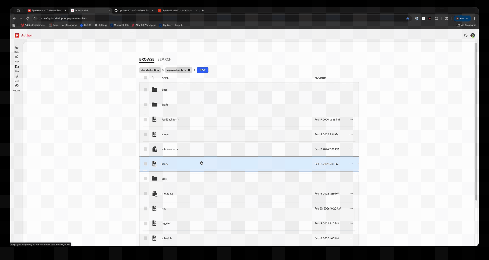
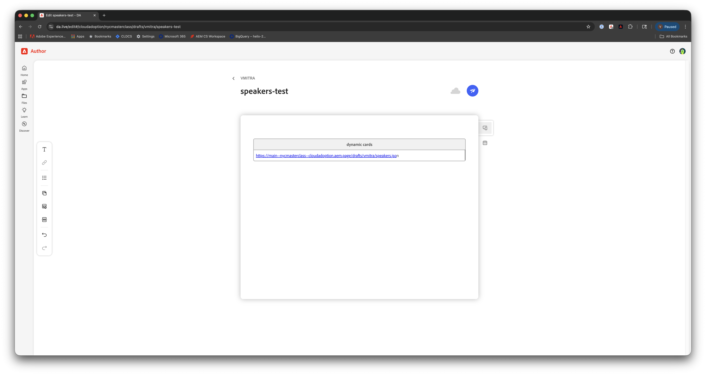
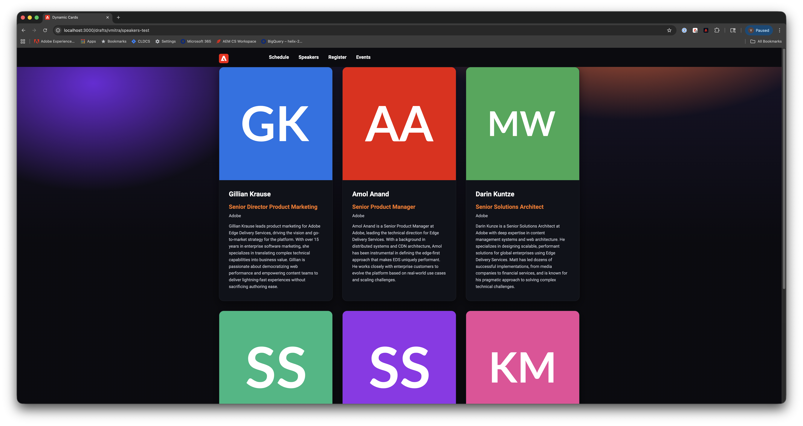
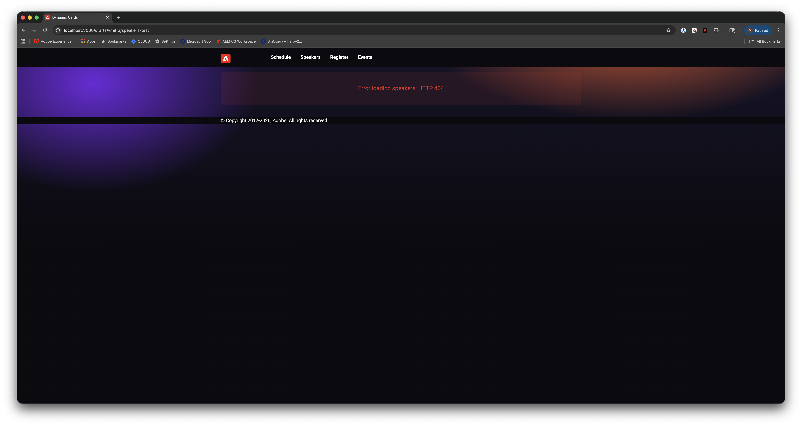

# Exercise 3: Dynamic Cards with Data Sources

**Duration**: 25 minutes

---

**Quick navigation**
- **Context**
  - [What You'll Learn](#what-youll-learn)
  - [Why This Matters](#why-this-matters)
  - [How It Works](#how-it-works)
- **Hands-on Lab**
  - [Step 1: Copy Speakers Data](#step-1-copy-speakers-data-to-your-workspace)
  - [Step 2: Add Your Personal Data](#step-2-add-your-personal-data)
  - [Step 3: Create Block Files](#step-3-create-block-files)
  - [Step 4: Implement JavaScript](#step-4-implement-javascript)
  - [Step 5: Implement Styles](#step-5-implement-styles)
  - [Step 6: Commit Your Changes](#step-6-commit-your-changes)
  - [Step 7: Create Test Page](#step-7-create-test-page)
  - [Step 8: Test Locally](#step-8-test-locally)
  - [Step 9: Test Error Handling](#step-9-test-error-handling)
  - [Step 10: Optional - Apply to Real Speakers Page](#step-10-optional---apply-to-real-speakers-page)
- [Key Takeaways](#key-takeaways)

---

## The Speakers Page

If you've been exploring the site, you may have noticed the **Speakers** link in the navigation leads to a placeholder page at http://localhost:3000/speakers

That page currently says "Coming Soon: Dynamic Speaker Profiles" and mentions this exercise!

The speaker data already exists at `/speakers.json` with 6 Adobe experts. In this exercise, you'll build the dynamic-cards block that will eventually power that page.

**You'll work in your own drafts folder** to avoid conflicts with other participants, but the block you build is production-ready and reusable.

---

## Prerequisites

**Complete [SETUP.md](../SETUP.md) if not already done.** Exercises can be done in sequence or independently; if independent, ensure SETUP is done and you have the items below.

**Required:**
- On your feature branch (`jsmith` — first initial + last name, lowercase)
- Local dev server at `http://localhost:3000`
- Code editor open with the repository
- Exercises 1–2 completed (if doing in sequence)

**Verify you're on your branch**:
```bash
git branch
# Should show: * jsmith (your name)
```

---

## What You'll Learn

- How to fetch data from external sources in blocks
- How Sheets convert to JSON in DA.live
- How to handle async operations and errors in blocks

---

## Why This Matters

In Exercise 2, you built blocks where authors manually create each card. But what if you need to display:
- 100+ speaker profiles from a database
- Product catalog with pricing that updates daily
- Event listings from an external API

**Manual authoring doesn't scale**. Dynamic blocks solve this by fetching data from external sources.

**The pattern**:
- Content lives in structured data (Sheet, API)
- Block fetches and renders that data
- Update the data once → all pages update automatically

**Real-world scenario**: The NYC Masterclass has a `/speakers` page that currently shows placeholder text. You saw it in the navigation. The speaker data already exists in `/speakers.json` (6 Adobe experts). Rather than manually authoring cards for each speaker, you'll build a dynamic-cards block that fetches and renders this data automatically.

**What you'll build**: A reusable dynamic-cards block that can fetch speaker data, product catalogs, article listings, or any JSON endpoint and render it as cards.

**Different rhythm from Exercise 2**: Here you'll commit the block code (Step 6) before creating the test page and testing (Steps 7–8). In Ex2 you built test content first and committed at the end. In Ex3 the block is committed first, then you add a page that uses it and verify.

---

## How It Works

```
1. Events team maintains speakers in a Google Sheet
2. DA.live converts Sheet to JSON endpoint
3. Dynamic Cards block fetches the JSON
4. Block renders cards from data
5. When sheet updates, all pages show new data
```

In this exercise we'll use a Sheet-based `.json` endpoint that lives as content in DA — but the block itself doesn't care where the data comes from. Any endpoint that returns the same JSON shape will work, whether it's a Cloudflare Worker, a third-party API, or a custom backend. Swap the URL and everything else stays the same.

**Reference**: [Integrations](https://www.aem.live/developer/integrations)

---

## Understanding Sheets as JSON

DA.live automatically converts Sheets to JSON endpoints.

**Sheet structure**:
```
| Name      | Title              | Company | Bio                    | Image          |
|-----------|--------------------|---------|-----------------------|----------------|
| John Doe  | Senior Developer   | Adobe   | Expert in EDS         | image-url      |
| Jane Smith| Product Manager    | Adobe   | Leading AEM innovation| image-url      |
```

**JSON endpoint**:
```
https://main--nycmasterclass--cloudadoption.aem.page/path/to/sheet.json
```

**JSON structure**:
```json
{
  "total": 2,
  "offset": 0,
  "limit": 2,
  "data": [
    {
      "Name": "John Doe",
      "Title": "Senior Developer",
      "Company": "Adobe",
      "Bio": "Expert in EDS",
      "Image": "image-url"
    }
  ]
}
```

**Key insight**: Column names become JSON keys, rows become objects in `data` array.

---

## Step 1: Copy Speakers Data to Your Workspace

To avoid conflicts with 50 participants, you'll create your own personal speakers data.

**In DA.live**:

1. Navigate to https://da.live/sheet#/cloudadoption/nycmasterclass/speakers
2. This is the master speakers.json with 6 Adobe experts
3. Go back to the root folder and select the `speakers` file and click `copy`
4. Navigate to `/drafts/jsmith/` (your folder)
5. **Paste** the speakers file
6. Rename it to `speakers` (keep it as a .json file)

  

**Verify**: You should now have `/drafts/jsmith/speakers.json`

---

## Step 2: Add Your Personal Data

Make this exercise meaningful by adding yourself as a speaker!

**In DA.live**, open `/drafts/jsmith/speakers` (the sheet you just copied)

**Add a new row** with your information:
- **Name**: Your full name (e.g., "John Smith")
- **Title**: Your job title (e.g., "Senior Developer")  
- **Company**: Your company name (e.g., "Acme Corp")
- **Bio**: Write 2-3 sentences about yourself and your experience
- **Image**: Use `https://i.pravatar.cc/400?img=X` (replace X with a number 1-70 for different avatars)
- **Session**: Leave blank or add "Participant"
- **LinkedIn**: Your LinkedIn URL (optional)

**Optional**: Add another row for a teammate sitting near you.

DA.live auto-saves. **Verify JSON endpoint** on localhost:
```
http://localhost:3000/drafts/jsmith/speakers.json
```

You should see 7-8 speakers (6 Adobe + your entries) in JSON format.

---

## Step 3: Create Block Files

In your code editor, create:

```
blocks/
  dynamic-cards/
    dynamic-cards.js
    dynamic-cards.css
```

---

## Step 4: Implement JavaScript

**File**: `blocks/dynamic-cards/dynamic-cards.js`

Copy this code:

```javascript
/**
 * Fetches speaker data and renders cards dynamically
 *
 * Author provides (in block):
 * - Row 1: Data source URL (sheet.json endpoint)
 */
export default async function decorate(block) {
  // Extract data source URL from block content
  const dataSource = block.querySelector('a')?.href;

  if (!dataSource) {
    block.textContent = 'Error: No data source specified';
    return;
  }

  // Show loading state
  block.innerHTML = '<p class="loading">Loading speakers...</p>';

  try {
    // Fetch data from sheet JSON endpoint
    const response = await fetch(dataSource);
    if (!response.ok) throw new Error(`HTTP ${response.status}`);

    const json = await response.json();
    const speakers = json.data;

    // Clear loading message
    block.innerHTML = '';

    if (!speakers || speakers.length === 0) {
      block.innerHTML = '<p>No speakers found.</p>';
      return;
    }

    // Create cards container
    const ul = document.createElement('ul');
    ul.className = 'dynamic-cards-list';

    // Generate card for each speaker
    speakers.forEach((speaker) => {
      const li = document.createElement('li');
      li.className = 'dynamic-card';

      li.innerHTML = `
        <div class="dynamic-card-image">
          
        </div>
        <div class="dynamic-card-body">
          <h3>${speaker.Name}</h3>
          <p class="dynamic-card-title">${speaker.Title}</p>
          <p class="dynamic-card-company">${speaker.Company}</p>
          <p class="dynamic-card-bio">${speaker.Bio}</p>
        </div>
      `;

      ul.append(li);
    });

    block.append(ul);
  } catch (error) {
    block.innerHTML = `<p class="error">Error loading speakers: ${error.message}</p>`;
    console.error('Dynamic Cards error:', error);
  }
}
```

**What this does**:
1. The block's entrypoint is the default-exported `decorate(block)` function — same as any block; EDS calls it with the block root element.
2. Extracts data source URL from block content (line 9)
3. Shows loading state while fetching (line 16)
4. Fetches JSON from endpoint (line 20-21)
5. Handles errors gracefully (line 58-61)
6. Generates card HTML for each speaker (line 40-54)
7. Uses `loading="lazy"` for images (line 46)

**Error handling**: If fetch fails, shows user-friendly message and logs to console.

---

## Step 5: Implement Styles

**File**: `blocks/dynamic-cards/dynamic-cards.css`

Copy this code:

```css
.dynamic-cards-list {
  list-style: none;
  margin: 0;
  padding: 0;
  display: grid;
  grid-template-columns: repeat(auto-fill, minmax(280px, 1fr));
  gap: 2rem;
}

.dynamic-card {
  background-color: var(--card);
  border-radius: 16px;
  overflow: hidden;
  transition: transform 0.3s ease, box-shadow 0.3s ease;
  box-shadow: var(--shadow);
  border: 1px solid rgb(255 255 255 / 5%);
}

.dynamic-card:hover {
  transform: translateY(-4px);
  box-shadow: 0 15px 40px rgb(0 0 0 / 60%);
  border-color: rgb(255 255 255 / 10%);
}

.dynamic-card-image img {
  width: 100%;
  aspect-ratio: 1 / 1;
  object-fit: cover;
  display: block;
}

.dynamic-card-body {
  padding: 1.5rem;
}

.dynamic-card-body h3 {
  color: white;
  font-size: 1.4rem;
  font-weight: 700;
  margin: 0 0 0.75rem;
  line-height: 1.3;
}

.dynamic-card-title {
  font-weight: 600;
  color: var(--brand-1);
  margin: 4px 0;
}

.dynamic-card-company {
  font-size: 14px;
  color: var(--muted);
  margin: 4px 0;
}

.dynamic-card-bio {
  font-size: 14px;
  line-height: 1.6;
  color: var(--muted);
  margin-top: 12px;
}

.dynamic-cards .loading,
.dynamic-cards .error {
  padding: 40px 20px;
  text-align: center;
  color: var(--muted);
}

.dynamic-cards .error {
  color: #d93025;
  background: rgb(217 48 37 / 10%);
  border-radius: 8px;
}

@media (width >= 600px) {
  .dynamic-cards-list {
    grid-template-columns: repeat(auto-fill, minmax(300px, 1fr));
  }
}

@media (width >= 900px) {
  .dynamic-cards-list {
    grid-template-columns: repeat(3, 1fr);
  }

  .dynamic-card-body {
    padding: 2rem;
  }
}
```

**Key points**:
- Matches the dark theme used by the Cards block (uses `var(--card)`, `var(--shadow)`, `var(--brand-1)`, `var(--muted)`)
- Same hover effect (lift + glow) as Cards block
- Responsive grid with breakpoints at 600px and 900px
- All selectors scoped to `.dynamic-card*`
- Loading and error states styled

---

## Step 6: Commit Your Changes

You're committing the block code now, before creating the test page (Step 7). This order keeps the block in version control first; then you'll add a page that uses it and verify.

```bash
# Run linting
npm run lint

# Add changes
git add blocks/dynamic-cards/

# Commit
git commit -m "feat: add dynamic-cards block"

# Push
git push origin jsmith
```

Replace `jsmith` with your branch name.

---

## Step 7: Create Test Page

**In DA.live**, create a new page: `/drafts/jsmith/speakers-test` (use your name)

Add this content:

```
# Dynamic Speaker Directory

This page demonstrates fetching speaker data dynamically from JSON.

| Dynamic Cards |
|---------------|
| /drafts/jsmith/speakers.json |
```
   

**Important**: Use YOUR actual path (replace `jsmith` with your first initial + last name).

DA.live auto-saves. Click **Preview** to see the page on localhost.

---

## Step 8: Test Locally

**Open**: `http://localhost:3000/drafts/jsmith/speakers-test` (use your name)

**Test on desktop and mobile**: Use Chrome DevTools responsive view — open DevTools (F12 or Cmd+Option+I), toggle the device toolbar (Cmd+Shift+M / Ctrl+Shift+M) to switch to responsive mode, then resize the viewport or pick a device preset to verify layout at different widths. Use this for all test steps in this exercise.

**You should see**:
- "Loading speakers..." message briefly
- 7-8 speaker cards (6 Adobe experts + your entries)
- Responsive grid layout
- Hover effect on cards
- Your speaker card among the Adobe experts

**Verify your data**:
- Find your speaker card in the grid
- Verify your name, title, company, and bio display correctly
- Check that your avatar image loads

     

**Test the data flow**:
1. Keep the page open at `http://localhost:3000/drafts/jsmith/speakers-test`
2. Go to DA.live and open `/drafts/jsmith/speakers`
3. Edit YOUR speaker row - change your bio or title
4. DA.live auto-saves. **Refresh** your local preview
5. Your changes should appear immediately

**Success criteria**: Dynamic-cards block fetches JSON and renders all speakers including your entry.

---

## Step 9: Test Error Handling

Production blocks must handle failures gracefully. Let's test error scenarios.

**Test 1 - Invalid URL**:

Edit your `/drafts/jsmith/speakers-test` page in DA.live, change the URL to:
```
| Dynamic Cards |
|---------------|
| https://invalid-url.com/data.json |
```

Refresh localhost. You should see: "Error loading speakers: [error message]" with red background.


**Test 2 - No URL**:

Remove the URL row entirely:
```
| Dynamic Cards |
|---------------|
```

Refresh localhost. You should see: "Error: No data source specified".

**Test 3 - Restore Working State**:

Change it back to your working speakers.json:
```
| Dynamic Cards |
|---------------|
| /drafts/jsmith/speakers.json |
```

Refresh. Speaker cards should display again.

**Why test errors?** Network can fail, URLs can break, data can be malformed. Your block should always show helpful feedback to users.

---

## Step 10: Optional - Apply to Real Speakers Page

Now that your dynamic-cards block is working, you can see how it would complete the real `/speakers` page.

**What you'd do** (don't actually do this - just understand the pattern):

1. **In DA.live**, open `/speakers` (the main speakers page with placeholder)
2. Replace placeholder content with:
```
| Dynamic Cards |
|---------------|
| /speakers.json |
```
3. Preview to see the page
4. The placeholder page becomes a dynamic speaker directory

**Why we don't do this now**: With 50 participants, we'd all be editing the same page simultaneously (conflicts!).

**In real projects**: You'd update the production page once your block is tested and committed to main branch.

**Key insight**: The same dynamic-cards block works for:
- Your personal test page (`/drafts/jsmith/speakers-test`)
- The real speakers page (`/speakers`)
- Any other page that needs to display JSON data as cards

This is the power of reusable blocks with dynamic data sources.

---

## Performance Considerations

**Loading states**: Always show feedback during async operations
```javascript
block.innerHTML = '<p class="loading">Loading...</p>';
```

**Error handling**: Network requests can fail
```javascript
try {
  const response = await fetch(url);
  if (!response.ok) throw new Error();
} catch (error) {
  // Show error to user
}
```

**Lazy loading images**: Use `loading="lazy"` for images below fold
```html

```

**Image optimization**: For production, consider rendering images from JSON with [createOptimizedPicture()](../../scripts/aem.js) from `aem.js` to get responsive srcset and format optimization. The exercise uses plain `` for simplicity.

**When to use dynamic blocks**:
- Large datasets (50+ items)
- Frequently updated content
- Shared across multiple pages
- Data from external systems

**When NOT to use**:
- Small, static content (use regular blocks)
- Above-the-fold content (impacts LCP)
- Rarely changing content

---

## Real-World Applications

**Use Case 1: Featured Articles from Query Index**
- Fetch from query-index.json (all published pages)
- Filter by tags (e.g., "featured") or recent publish date
- Display 3 most recent articles tagged "featured"
- Same dynamic-cards block, different data source

**Example**:
```
| Dynamic Cards |
|---------------|
| https://main--yoursite--owner.aem.live/query-index.json?tags=featured&limit=3 |
```

Note: In Exercise 4, you'll learn how query-index.json works and build a dedicated block for it.

**Use Case 2: E-commerce Product Catalog**
- Product data maintained in a Sheet
- Block fetches and renders product cards with pricing
- Update the sheet → all catalog pages update automatically

**Use Case 3: News/Blog Feeds**
- Articles indexed via query-index.json
- Block fetches and displays recent articles
- Filter by topic or tag using query parameters

---

## Key Takeaways

- Sheets automatically convert to JSON endpoints in DA.live
- Dynamic blocks fetch data instead of decorating authored content
- The same block works with any JSON endpoint
- Always handle loading states and errors
- Same JSON structure as Sheets - reusable patterns
- Performance: consider placement (below fold preferred)

---

## Verification Checklist

- [ ] Copied speakers.json to personal drafts folder
- [ ] Added 1-2 personal speaker entries (yourself + teammate)
- [ ] Verified JSON endpoint works on localhost
- [ ] Created dynamic-cards block files (JS + CSS)
- [ ] Created test page with dynamic-cards block
- [ ] Block displays all speakers (Adobe experts + your entries)
- [ ] Tested editing sheet data - changes reflected on refresh
- [ ] Tested error handling (invalid URL, no URL, restore)
- [ ] Tested in Chrome DevTools responsive view (desktop and mobile)
- [ ] Understand the sheet-to-JSON data flow
- [ ] Committed and pushed block code changes

---

## References

- [Integrations](https://www.aem.live/developer/integrations)
- [DA.live Sheets](https://docs.da.live/administrators/guides/sheets)
- [DA.live API](https://docs.da.live/developers/api)

---

## Before You Move On

**Do this now — it takes 2 minutes and unlocks Exercise 4.**

Exercise 4 has you search for your own page. But the search index only includes `/sessions/**` and `/labs/**` — not `/drafts/**`. Your Exercise 1 page needs to be published to `/labs/jsmith/` before you start Ex4, otherwise it won't appear in search results.

### Steps

1. Go to [DA.live](https://da.live) and navigate to `/drafts/jsmith/`
2. Find your Exercise 1 page (e.g., `my-session` or `my-lab`)
3. Click the **3-dot menu → Copy**
4. Navigate to `/labs/` → **New → Folder** → name it `jsmith`
5. Inside `/labs/jsmith/`, paste the page
6. Open the page → **Preview** → **Publish**

That's it. The index updates in the background — by the time you get to Ex4 testing, your page will be findable.

---

## Solution

The complete solution for this exercise is available on the [answers branch](https://github.com/cloudadoption/nycmasterclass/tree/answers). The same branch contains solutions for all lab exercises.

---

## Next Exercise

**Exercise 4**: Extend Search Block from Block Collection — You'll configure and test a Search block that fetches `query-index.json` and renders results using the Cards block. You'll learn how EDS indexes published content, how block composition works, and find your own `/labs/jsmith/` page via live search.
