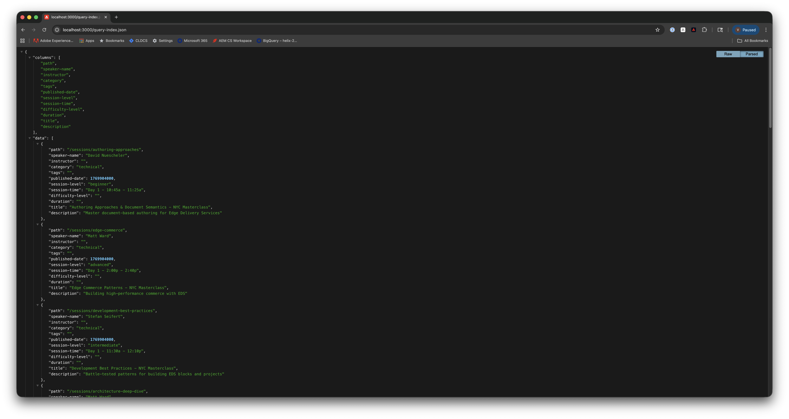
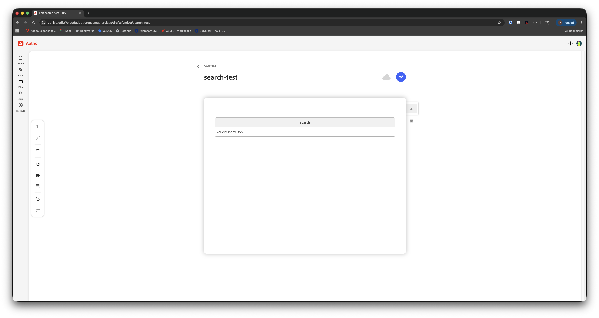
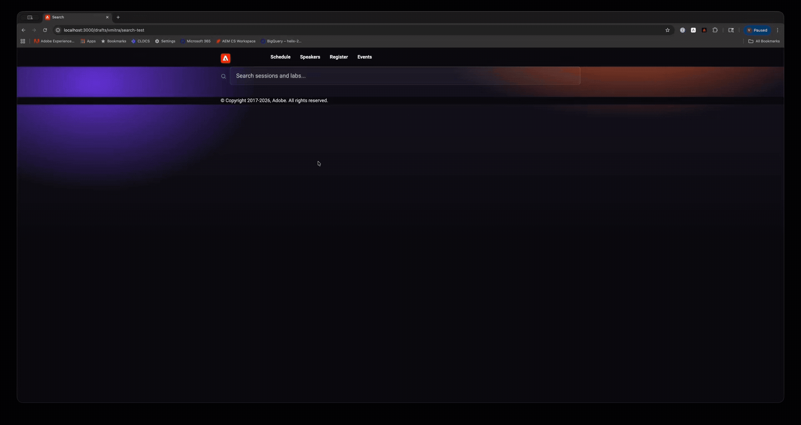

# Exercise 4: Extend Search Block from Block Collection

**Duration**: 25 minutes

---

**Quick navigation**
- **Context**
  - [What You'll Learn](#what-youll-learn)
  - [Why This Matters](#why-this-matters)
  - [How Query Index Works](#how-query-index-works)
- **Hands-on Lab**
  - [Step 1: Verify query-index.json](#step-1-verify-query-indexjson)
  - [Step 2: Look at the Block Collection Reference](#step-2-look-at-the-block-collection-reference)
  - [Step 3: Create Block Files](#step-3-create-block-files)
  - [Step 4: Implement JavaScript](#step-4-implement-javascript)
  - [Step 5: Implement Styles](#step-5-implement-styles)
  - [Step 6: Create Test Page in DA.live](#step-6-create-test-page-in-dalive)
  - [Step 7: Test the Search Block](#step-7-test-the-search-block)
  - [Step 8: Test Edge Cases](#step-8-test-edge-cases)
  - [Step 9: Commit Your Changes](#step-9-commit-your-changes)
- [Key Takeaways](#key-takeaways)

---

## Prerequisites

**Complete [SETUP.md](../SETUP.md) if not already done.** Exercises can be done in sequence or independently; if independent, ensure SETUP is done and you have the items below.

**Required:**
- On your feature branch (`jsmith` — first initial + last name, lowercase)
- Local dev server at `http://localhost:3000`
- Code editor open with the repository
- Exercises 1–3 completed (if doing in sequence)
- Exercise 1 page published to `/labs/jsmith/` (see end of Exercise 3)
- DA.live access

**Verify you're on your branch**: `git branch` → should show `* jsmith` (your name).

---

## What You'll Learn

- How the AEM Block Collection provides reusable reference blocks
- How to extend a Block Collection block for your project
- How `query-index.json` works as a search data source
- How live search (input event, min 3 chars) differs from form-submit search
- How `<mark>` highlighting works for matched terms
- How URL state persistence works via `?q=` params
- How block composition works — Search imports and calls Cards' `decorate()` to render results

---

## Why This Matters

**The AEM Block Collection** (`github.com/adobe/aem-block-collection`) is a library of production-ready reference blocks maintained by Adobe. It is separate from the boilerplate — blocks are not included automatically, but you can extend them for your project.

**The pattern**:
- Find a Block Collection block that is close to what you need
- Copy it into your project as a starting point
- Adapt it: remove dependencies your project doesn't have, restyle to match your theme, configure for your data source

**Why extend rather than write from scratch?**
- Production patterns already handled (accessibility, ARIA, keyboard nav, URL state)
- Faster to adapt than to reinvent
- Your adaptations are explicit and reviewable

**The search block you'll extend** uses `query-index.json` — a flat JSON file EDS pre-generates at publish time from all indexed pages. No runtime database, no third-party search service.

---

## How Query Index Works

```
1. Author publishes page to .aem.live
2. EDS extracts metadata using CSS selectors defined in the index config
3. Data stored in /query-index.json
4. Your block fetches and filters the data client-side
```

**Important**: Only **published** pages (`.aem.live`) are indexed — not preview (`.aem.page`) or drafts.

### This project's index configuration

The index for this site is configured with the following `query.yaml`:

```yaml
version: 1
indices:
  default:
    target: /query-index.json
    include:
      - /sessions/**
      - /labs/**
    properties:
      speaker-name:
        value: attribute(el, "content")
        select: head > meta[name="speaker-name"]
      instructor:
        value: attribute(el, "content")
        select: head > meta[name="instructor"]
      category:
        value: attribute(el, "content")
        select: head > meta[name="category"]
      tags:
        value: attribute(el, "content")
        select: head > meta[name="tags"]
      published-date:
        value: parseTimestamp(attribute(el, "content"), "MM/DD/YYYY")
        select: head > meta[name="published-date"]
      session-level:
        value: attribute(el, "content")
        select: head > meta[name="session-level"]
      session-time:
        value: attribute(el, "content")
        select: head > meta[name="session-time"]
      difficulty-level:
        value: attribute(el, "content")
        select: head > meta[name="difficulty-level"]
      duration:
        value: attribute(el, "content")
        select: head > meta[name="duration"]
      title:
        value: textContent(el)
        select: head > title
      description:
        value: attribute(el, "content")
        select: head > meta[name="description"]
    exclude:
      - /drafts/**
```

**What this tells you**:
- **Only `/sessions/**` and `/labs/**` are indexed** — other paths (including `/drafts/**`) are excluded
- **Custom properties** are extracted from `<meta>` tags in the page `<head>` — these are the same metadata fields you set in Exercise 1
- **`parseTimestamp`** converts the `MM/DD/YYYY` date string authors write into a Unix timestamp for sorting
- The built-in fields (`path`, `title`, `description`, `image`, `lastModified`) are always included automatically

**Reference**: [Indexing Reference](https://www.aem.live/docs/indexing-reference)

---

## Step 1: Verify query-index.json

Verify your `/labs/jsmith/` page from the end of Exercise 3 appears in the index:

```
http://localhost:3000/query-index.json
```

Look for your `/labs/jsmith/my-session` path in the `data` array.

**Validate index definition**: [Index Admin](https://tools.aem.live/tools/index-admin/index.html?org=cloudadoption&site=nycmasterclass) — use this tool to fetch and validate the index configuration (include/exclude paths, properties) for this org/site.

  

> **Note**: Index updates can take a few minutes after publishing. If you don't see your page yet, continue — it will be there by the time you test.


---

## Step 2: Look at the Block Collection Reference

The search block we're extending lives at:

```
https://github.com/adobe/aem-block-collection/tree/main/blocks/search
```

Open it and take a quick look. The Block Collection version has two variants:
- **Default** — full search box with results rendered as cards
- **Minimal** — search box only (results handled externally)

**What we're adapting for this project**:
- Remove `fetchPlaceholders` dependency — this project doesn't have `scripts/placeholders.js`, so we'll hardcode the strings
- Remove the minimal variant — not needed here
- Render results via the **Cards block** (block composition) instead of custom card markup
- Restyle CSS to match the masterclass dark theme
- Configure default data source to `/query-index.json`
- Expand search fields to include `instructor`, `speaker-name`, `category`, and `tags`

---

## Step 3: Create Block Files

In your code editor, create:

```
blocks/
  search/
    search.js
    search.css
```

---

## Step 4: Implement JavaScript

**File**: `blocks/search/search.js`

> **Tip**: The full implementation is also available on the [answers branch on GitHub](https://github.com/cloudadoption/nycmasterclass/tree/answers/blocks/search) if you prefer to copy from there.

Copy this code:

```javascript
import {
  createOptimizedPicture,
  decorateIcons,
  loadCSS,
} from '../../scripts/aem.js';
import decorateCards from '../cards/cards.js';

/**
 * Search block — extended from the AEM Block Collection search block.
 * https://github.com/adobe/aem-block-collection/tree/main/blocks/search
 *
 * Adaptations for this project:
 * - Removed fetchPlaceholders dependency (strings hardcoded below)
 * - Removed minimal variant
 * - Styled to match masterclass dark theme
 * - Results rendered via Cards block (block composition pattern)
 *
 * Content model:
 *   | Search |
 *   |--------|
 *   | /query-index.json |   ← optional: URL to query-index. Defaults to /query-index.json
 */

const SEARCH_PLACEHOLDER = 'Search sessions and labs...';
const NO_RESULTS_TEXT = 'No results found.';
const MIN_SEARCH_LENGTH = 3;

const searchParams = new URLSearchParams(window.location.search);
let cssLoaded = false;

function ensureCardsCSS() {
  if (!cssLoaded) {
    const base = window.hlx?.codeBasePath || '';
    loadCSS(`${base}/blocks/cards/cards.css`);
    cssLoaded = true;
  }
}

function highlightTextElements(terms, elements) {
  elements.forEach((element) => {
    if (!element || !element.textContent) return;

    const matches = [];
    const { textContent } = element;
    terms.forEach((term) => {
      let start = 0;
      let offset = textContent.toLowerCase().indexOf(term.toLowerCase(), start);
      while (offset >= 0) {
        matches.push({ offset, term: textContent.substring(offset, offset + term.length) });
        start = offset + term.length;
        offset = textContent.toLowerCase().indexOf(term.toLowerCase(), start);
      }
    });

    if (!matches.length) return;

    matches.sort((a, b) => a.offset - b.offset);
    let currentIndex = 0;
    const fragment = matches.reduce((acc, { offset, term }) => {
      if (offset < currentIndex) return acc;
      const textBefore = textContent.substring(currentIndex, offset);
      if (textBefore) acc.appendChild(document.createTextNode(textBefore));
      const markedTerm = document.createElement('mark');
      markedTerm.textContent = term;
      acc.appendChild(markedTerm);
      currentIndex = offset + term.length;
      return acc;
    }, document.createDocumentFragment());
    const textAfter = textContent.substring(currentIndex);
    if (textAfter) fragment.appendChild(document.createTextNode(textAfter));
    element.replaceChildren(fragment);
  });
}

export async function fetchData(source) {
  const response = await fetch(source);
  if (!response.ok) {
    // eslint-disable-next-line no-console
    console.error('error loading API response', response);
    return null;
  }
  const json = await response.json();
  if (!json) {
    // eslint-disable-next-line no-console
    console.error('empty API response', source);
    return null;
  }
  const data = json.data ?? null;
  return Array.isArray(data) ? data : null;
}

/**
 * Builds the pre-decoration DOM structure that cards.decorate() expects.
 * Each result becomes one row:
 *   div (row = one card)
 *     div (image column — only if result.image exists)
 *       picture
 *     div (body column)
 *       p > strong > a[href]  — title link (highlighted)
 *       p                     — description (highlighted)
 */
function buildCardsBlock(results, searchTerms) {
  const cardsDiv = document.createElement('div');
  cardsDiv.className = 'cards';

  results.forEach((result) => {
    const row = document.createElement('div');

    if (result.image) {
      const imageDiv = document.createElement('div');
      const pic = createOptimizedPicture(result.image, result.title || '', false, [{ width: '750' }]);
      imageDiv.append(pic);
      row.append(imageDiv);
    }

    const body = document.createElement('div');

    const titleP = document.createElement('p');
    const strong = document.createElement('strong');
    const link = document.createElement('a');
    link.href = result.path;
    link.textContent = result.title || result.path;
    highlightTextElements(searchTerms, [link]);
    strong.append(link);
    titleP.append(strong);
    body.append(titleP);

    if (result.description) {
      const descP = document.createElement('p');
      descP.textContent = result.description;
      highlightTextElements(searchTerms, [descP]);
      body.append(descP);
    }

    row.append(body);
    cardsDiv.append(row);
  });

  return cardsDiv;
}

function clearSearchResults(block) {
  block.querySelector('.search-results').replaceChildren();
}

function clearSearch(block) {
  clearSearchResults(block);
  if (window.history.replaceState) {
    const url = new URL(window.location.href);
    url.search = '';
    searchParams.delete('q');
    window.history.replaceState({}, '', url.toString());
  }
}

function compareFound(hit1, hit2) {
  return hit1.minIdx - hit2.minIdx;
}

function filterData(searchTerms, data) {
  const foundInHeader = [];
  const foundInMeta = [];

  data.forEach((result) => {
    let minIdx = -1;

    searchTerms.forEach((term) => {
      const idx = (result.header || result.title || '').toLowerCase().indexOf(term);
      if (idx < 0) return;
      if (minIdx < idx) minIdx = idx;
    });

    if (minIdx >= 0) {
      foundInHeader.push({ minIdx, result });
      return;
    }

    const pathSuffix = (result.path || '').split('/').pop() || '';
    const metaContents = [
      result.title,
      result.description,
      result.instructor,
      result['speaker-name'],
      result.category,
      result.tags,
      pathSuffix,
    ].filter(Boolean).join(' ').toLowerCase();
    searchTerms.forEach((term) => {
      const idx = metaContents.indexOf(term);
      if (idx < 0) return;
      if (minIdx < idx) minIdx = idx;
    });

    if (minIdx >= 0) foundInMeta.push({ minIdx, result });
  });

  return [
    ...foundInHeader.sort(compareFound),
    ...foundInMeta.sort(compareFound),
  ].map((item) => item.result);
}

async function renderResults(block, config, filteredData, searchTerms) {
  clearSearchResults(block);
  const searchResults = block.querySelector('.search-results');

  if (filteredData.length) {
    ensureCardsCSS();
    const cardsDiv = buildCardsBlock(filteredData, searchTerms);
    decorateCards(cardsDiv);
    searchResults.append(cardsDiv);
  } else {
    const noResultsMessage = document.createElement('p');
    noResultsMessage.className = 'search-status';
    noResultsMessage.textContent = NO_RESULTS_TEXT;
    searchResults.append(noResultsMessage);
  }
}

async function handleSearch(e, block, config) {
  const searchValue = e.target.value;
  searchParams.set('q', searchValue);
  if (window.history.replaceState) {
    const url = new URL(window.location.href);
    url.search = searchParams.toString();
    window.history.replaceState({}, '', url.toString());
  }

  if (searchValue.length < MIN_SEARCH_LENGTH) {
    clearSearch(block);
    return;
  }

  const searchTerms = searchValue.toLowerCase().split(/\s+/).filter((term) => !!term);
  const data = await fetchData(config.source);
  if (data) await renderResults(block, config, filterData(searchTerms, data), searchTerms);
}

function searchResultsContainer() {
  const results = document.createElement('div');
  results.className = 'search-results';
  results.setAttribute('role', 'status');
  results.setAttribute('aria-live', 'polite');
  results.setAttribute('aria-atomic', true);
  return results;
}

function searchBox(block, config) {
  const input = document.createElement('input');
  input.setAttribute('type', 'search');
  input.className = 'search-input';
  input.placeholder = SEARCH_PLACEHOLDER;
  input.setAttribute('aria-label', SEARCH_PLACEHOLDER);

  input.addEventListener('input', (e) => handleSearch(e, block, config));
  input.addEventListener('keyup', (e) => { if (e.code === 'Escape') clearSearch(block); });

  const icon = document.createElement('span');
  icon.classList.add('icon', 'icon-search');

  const box = document.createElement('div');
  box.classList.add('search-box');
  box.append(icon, input);
  return box;
}

/**
 * loads and decorates the block
 * @param {Element} block The block element
 */
export default async function decorate(block) {
  const source = block.querySelector('a[href]')?.href || '/query-index.json';
  block.replaceChildren(
    searchBox(block, { source }),
    searchResultsContainer(),
  );

  if (searchParams.get('q')) {
    const input = block.querySelector('input');
    input.value = searchParams.get('q');
    input.dispatchEvent(new Event('input'));
  }

  decorateIcons(block);
}
```

**What you just copied — key adaptations from Block Collection**:

- **`ensureCardsCSS()`** — loads `cards.css` on demand the first time results render. The Cards block stylesheet may not be present if there's no Cards block on the page, so we load it ourselves
- **`buildCardsBlock(results, searchTerms)`** — block composition: builds the pre-decoration DOM that `cards.decorate()` expects, with `<mark>` highlighting applied to titles and descriptions *before* Cards transforms the DOM (marks survive the transformation)
- **`filterData(searchTerms, data)`** — two-pass ranking: title/header matches rank first, then `title + description + instructor + speaker-name + category + tags + path` matches. Custom fields from the index config are all searchable
- **`handleSearch()`** — fires on every `input` event (live search, no submit button). Updates `?q=` URL param so searches are bookmarkable. Skips fetch for queries under 3 characters
- **`decorate(block)`** — reads optional data source URL from the block's first link, defaults to `/query-index.json`. Restores search from `?q=` param on page load

**Note on `innerHTML`**: You'll notice this code never uses `innerHTML` to insert user-controlled content. `highlightTextElements` uses `DocumentFragment` and `createElement` instead — this prevents XSS vulnerabilities.

---

## Step 5: Implement Styles

**File**: `blocks/search/search.css`

> **Tip**: Also available on the [answers branch on GitHub](https://github.com/cloudadoption/nycmasterclass/tree/answers/blocks/search).

Copy this code:

```css
/* Search block — extended from AEM Block Collection */

.search .search-box {
  display: grid;
  grid-template-columns: auto 1fr;
  gap: 1ch;
  align-items: center;
}

.search .search-box .icon {
  width: 1.25rem;
  height: 1.25rem;
  flex-shrink: 0;
}

.search .search-box .icon img {
  filter: invert(1) opacity(0.5);
}

.search .search-box input {
  box-sizing: border-box;
  display: block;
  width: 100%;
  margin: 0;
  padding: 0.75rem 1rem;
  border-radius: 8px;
  border: 1px solid rgb(255 255 255 / 20%);
  background: rgb(255 255 255 / 5%);
  color: var(--ink);
  font-size: var(--body-font-size-s);
  font-family: var(--body-font-family);
  outline: none;
  transition: border-color 0.2s ease, background 0.2s ease;
}

.search .search-box input::placeholder {
  color: var(--muted);
}

.search .search-box input:focus {
  border-color: var(--brand-1);
  background: rgb(255 255 255 / 8%);
}

/* search results wrapper — Cards block handles individual card styles */
.search .search-results {
  display: block;
  margin-top: 2rem;
}

/* ensure cards grid is visible when nested in search */
.search .search-results .cards {
  display: block;
}

/* status messages (no results, errors) */
.search .search-status {
  text-align: center;
  color: var(--muted);
  font-size: var(--body-font-size-s);
  padding: 2rem 0;
}

/* highlight matched terms */
.search mark {
  background: transparent;
  color: var(--brand-1);
  font-weight: 700;
}

@media (width >= 600px) {
  .search .search-box input {
    font-size: var(--body-font-size-m);
    padding: 0.875rem 1.25rem;
  }
}
```

**Key points**:
- Search box uses CSS Grid (`auto 1fr`) — icon stays fixed width, input fills remaining space
- **No card styles here** — because the Cards block (`cards.css`) handles all card layout, dark backgrounds, hover effects. This is the benefit of block composition: no duplication
- `.search-status` — centered muted text for "No results found."
- `mark` styling overrides the browser default (yellow highlight) with the site brand color

---

## Step 6: Create Test Page in DA.live

In [DA.live](https://da.live), create page: `/drafts/jsmith/search-test` (use your name)

Add this content:

```
# Search

| Search |
|--------|
| /query-index.json |
```

**What you're authoring**:
- Block name: `Search`
- Row 1: URL of the data source (`/query-index.json`)

The URL row is optional — if omitted, the block defaults to `/query-index.json`. Authors can point the block at any JSON endpoint that returns `{ data: [...] }`.

  

DA.live auto-saves. Click **Preview** to see the page on localhost.

---

## Step 7: Test the Search Block

Open: `http://localhost:3000/drafts/jsmith/search-test`

**Test on desktop and mobile**: Use Chrome DevTools responsive view — open DevTools (F12 or Cmd+Option+I), toggle the device toolbar (Cmd+Shift+M / Ctrl+Shift+M) to switch to responsive mode, then resize the viewport or pick a device preset to verify layout at different widths. Use this for all test steps in this exercise.

**You should see**:
- A search icon + input field with placeholder "Search sessions and labs..."
- No results until you type at least 3 characters

**Run these searches**:

| Query | Expected |
|-------|----------|
| `technical` | All session pages that contain `technical` (matches `category` field) |
| `lab` | All lab pages + your `/labs/jsmith/` page (matches title and path) |
| `stefan` | 2 sessions by Stefan Seifert (matches `speaker-name` field) |
| Your first name (e.g. `sagar`) | Your `/labs/jsmith/` page (matches `instructor` field — requires your page to be published) |
| `development` | Lab pages in the development category |
| Your session or lab title (or part of it) | Your `/labs/jsmith/` page |
| `xyz123` | "No results found." message |
| `edge` | All pages matching `edge` in title or description |

Results render as Cards block cards — same dark cards with hover effect you saw in Exercise 2.

**Check URL state**: Type a query and look at the browser URL bar — you should see `?q=yourquery`. Copy that URL, open a new tab, paste it — the search runs automatically on load.

**Escape key**: Press Escape while the input is focused to clear the search and results.

  

---

## Step 8: Test Edge Cases

| Scenario | Expected behavior |
|----------|-------------------|
| Query shorter than 3 chars | Results cleared, no fetch |
| Query with no matches (`xyz123`) | "No results found." |
| Escape key | Results cleared, URL param removed |
| Page load with `?q=session` in URL | Search runs automatically |

---

## Step 9: Commit Your Changes

```bash
# Lint before committing
npm run lint

# Stage changes
git add blocks/search/

# Commit
git commit -m "feat: extend search block from block collection"

# Push
git push origin jsmith
```

Replace `jsmith` with your branch name.

---

## Key Takeaways

- **Block Collection** is a library of reference blocks — not boilerplate, but a starting point to extend
- **Extending** means: copy → remove unnecessary dependencies → adapt styling → configure for your data
- **Block composition** — Search imports and calls Cards' `decorate()` rather than duplicating card markup; `loadCSS` loads the Cards stylesheet on demand
- **`query-index.json`** pre-generates search data at publish time — no runtime database
- **Only published pages** on `.aem.live` under `/sessions/**` or `/labs/**` are indexed
- **Live search** (input event, min 3 chars) gives immediate feedback without a submit button
- **`<mark>` highlighting** shows users exactly why a result matched their query — applied before Cards decoration so marks persist through DOM transformation
- **URL state** (`?q=`) makes searches bookmarkable and shareable
- **No `innerHTML` for user input** — `DocumentFragment` + `createElement` prevents XSS

---

## Verification Checklist

- [ ] `/labs/jsmith/<your-page-name>` visible in `query-index.json`
- [ ] `blocks/search/search.js` and `blocks/search/search.css` created
- [ ] Search input renders on `http://localhost:3000/drafts/jsmith/search-test`
- [ ] Typing at least 3 characters triggers a search
- [ ] Results render as Cards block cards
- [ ] Your own `/labs/jsmith/` page is findable by searching its title
- [ ] Matched terms are highlighted in brand color
- [ ] "No results found" message shows for unmatched query
- [ ] URL updates with `?q=` param as you type
- [ ] Escape key clears the search
- [ ] Tested in Chrome DevTools responsive view (desktop and mobile)
- [ ] `npm run lint` passes

---

## References

- [AEM Block Collection — Search](https://github.com/adobe/aem-block-collection/tree/main/blocks/search)
- [Indexing Reference](https://www.aem.live/docs/indexing-reference)
- [Index Admin Tool](https://tools.aem.live/tools/index-admin/index.html?org=cloudadoption&site=nycmasterclass) — fetch and validate the index definition for this site
- [EDS Indexing Concepts](https://www.aem.live/developer/indexing)

---

## Solution

The complete solution for this exercise (search block) is on the [answers branch](https://github.com/cloudadoption/nycmasterclass/tree/answers). The same branch contains solutions for all lab exercises.

---

## Next Exercise

**Exercise 5**: JSON2HTML — Generate hundreds of pages from JSON data using Mustache templates. You'll learn how to create dynamic pages at scale without manually authoring each one.
